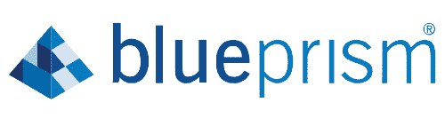
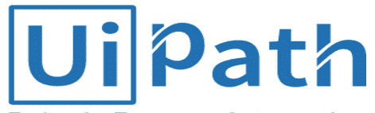
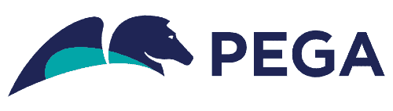
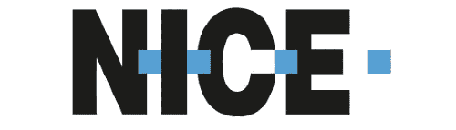
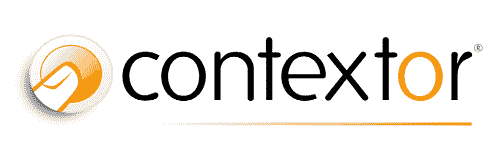
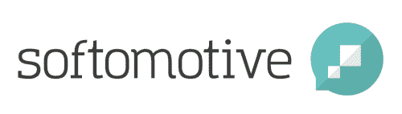
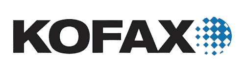

# 顶级 RPA 供应商

> 原文：<https://www.javatpoint.com/top-rpa-vendors>

在数字市场中，RPA 被认为是最具创新性的技术之一。随着企业试图在软件的帮助下更容易、更快地做事，It 发展非常迅速。这样的软件可以帮助自动化数字业务流程，并做出准确的决策。RPA 可以简化重复性和基于规则的业务流程。它使系统能够在 RPA 软件机器人的帮助下做出智能决策。

因此，选择合适的供应商，能够找到合适的业务流程，提供 [RPA](https://www.javatpoint.com/rpa) 解决方案的成功实施，是非常重要的。选择合适的供应商将帮助组织探索 RPA 的全部潜力。

让我们详细介绍 RPA 的顶级供应商:

## BluePrism

Blue Prism 是 Blue Prism 有限公司的注册名称，该公司是一家总部位于英国的跨国软件公司。它于 2001 年推出。Blue Prism 的主要目标是提供一种技术，帮助组织提高工作流的准确性和效率。

蓝棱镜是发明“RPA”一词的顶级自动化公司之一。它使用业务规则以各种方式自动化数字劳动力。它在投资公司、银行集团、电子商务等不同领域发挥着重要作用。

2019 年，Blue Prism 增加了三个新的软件即服务(SaaS)解决方案:

*   蓝棱镜云枢纽
*   BluePrism 云相互作用
*   BluePrism 云 IADA

**云枢纽**被定义为一个基于网络的管理控制台，允许组织控制其数字员工。它还增加了围绕信息周期的功能，以便轻松管理员工。

**交互**功能帮助人类在开发的自动化工作流程中与软件机器人进行交互，因为某些流程可能需要人工干预。

术语 IADA 代表**智能自动化数字助理**。这是一个基于[人工智能](https://www.javatpoint.com/artificial-intelligence-tutorial)的编排工具，帮助组织最大限度地提高员工的生产力。

## UiPath(路径)

它是一家世界领先的 RPA 公司，根据特定的行业、技术和流程提供解决方案。它于 2005 年推出。蓝棱镜总部在美国纽约成立。

UiPath 提供了一个 RPA 平台，可以跨前端和后端办公任务自动执行数字业务流程。它包括工作室、软件机器人和管弦乐队等产品。提供[银行](https://www.javatpoint.com/banking-full-forms)、金融、 [BPO](https://www.javatpoint.com/bpo-full-form) (业务流程外包)、保险、零售、电信、制造、医疗、公共部门等多个行业的解决方案。它允许用户执行 Web 自动化、桌面自动化、 [GUI](https://www.javatpoint.com/gui-full-form) (图形用户界面)自动化、 [SAP](https://www.javatpoint.com/sap-full-form) 自动化、大型机自动化、Citrix 自动化、Excel 自动化、屏幕抓取和屏幕记录器等。

2019 年 10 月，该公司增加了更多产品(即 UiPath Explorer、UiPath Apps 和 UiPath Insights)，以支持人工智能和端到端自动化。这些产品帮助企业在前台和后台操作中与软件机器人进行交互。

## 任何地方的自动化

这是一家位于美国的专业 RPA 公司。它于 2003 年推出。该公司提供了一个开发 RPA 软件的企业平台。它开发了自动执行重复性和基于规则的任务的软件机器人。它还包括认知机器学习和分析技术，使组织能够更快地管理其业务流程。该公司提供广泛的产品，如 RPA、机器人农场、机器人洞察、智商机器人和机器人商店。它还使用了结合了有人值守和无人值守 RPA 的技术。

它为金融、银行、医疗保健、科学、保险、公共部门、业务流程外包、电信、零售和制造业等不同行业提供解决方案。该公司服务于欧洲和亚洲的客户。

## pegassystems

它是 RPA 行业领域的顶级供应商之一。这是一家总部位于美国的 RPA 公司。它于 1983 年推出。它提供数字流程自动化、业务流程管理和[客户关系管理](https://www.javatpoint.com/customer-relationship-management)方面的解决方案。

Pega 平台的一些顶级服务包括应用开发、聊天机器人和虚拟助理、案例管理、决策管理、员工智能、测试、移动性和机器人自动化。Pega 提供了组织数字化改造流程所需的一切。

Pega 平台有三种主要类型:

*   佩加机器人自动化
*   采取行动
*   抓住云

像其他 RPA 供应商一样，Pegasystems 还提供银行、保险、金融服务、医疗保健、通信、科学、政府、零售、制造、媒体和娱乐、运输、酒店等领域的解决方案。

## 很好

NICE 是提供有人值守和无人值守自动化解决方案的 RPA 供应商之一。它帮助组织在 RPA 软件机器人的帮助下做出更明智的决策，以提供更好的客户服务、更高的生产率、更高的准确性和快速的投资回报。

该供应商于 2011 年正式收购了 Eglue，并开始与 RPA 合作。它进一步扩展到欧洲和美国，与先进的机器人自动化合作。

NICE 提供 RPA、桌面分析和 **NEVA (Nice 员工虚拟服务员)**出席自动化等产品。它还提供了像数字助理一样的桌面自动化。桌面自动化帮助组织在软件机器人的帮助下自动化重复的桌面任务。它们还可以配置为向员工提供反馈，这将有助于更高效、更准确地完成任务。

## 上下文(被思爱普收购)

Contextor 也是 RPA 行业中顶级的 RPA 供应商之一。它于 2000 年推出。2018 年，总部位于德国的 SAP 公司收购了 Contextor，将 RPA 能力集成到他们的产品中。SAP 包括 SAP 云平台的 Contextor 工具的 RPA 功能、文档处理和 SAP Leonardo [机器学习](https://www.javatpoint.com/machine-learning)的对话式 AI 技术。它帮助思爱普交付了智能 RPA，并加速了思爱普莱昂纳多机器学习产品组合的开发。

Contextor 还包括监控业务活动和发现业务流程的解决方案。业务监控有助于衡量与业务相关的活动，并根据这些活动生成报告。业务发现有助于理解用户活动，并根据这些活动产生见解。

## 工作融合

WorkFusion 成立于 2010 年。它提供快速部署，使其不同于竞争对手。它可以在十二周内部署 RPA。WorkFusion 提供了一个智能自动化云系统，分为业务层和企业层。智能自动化云系统还提供个人自动化项目的免费快速版。

智能自动化云是建立在人工智能基础上的业务自动化指挥中心。它用于自动化重复性和基于规则的数字业务流程。

WorkFusion 被称为**软件即服务(SaaS)** 云计算平台。它是金融服务、电子商务和零售行业等数字流程自动化的完整自动化解决方案。它使用**统计质量控制(SQC)** 来提供工作输出的准确性。

## 软动力

它是广泛使用的 RPA 供应商之一，可以帮助组织将其重复性任务置于自动驾驶状态。它于 2005 年推出。它以提供象限知识解决方案而闻名。Softomotive 的主要目标是提供最流畅的 RPA 体验。它对小型组织很有用。

Softomotive 提供了一份用于共享服务的数字转型研究报告。它允许桌面和企业自动化最大限度地利用 RPA 的优势。组织可以根据自己的需求在这些自动化之间进行选择。

桌面自动化代表桌面和基于网络的流程的自动化，企业自动化代表数字企业流程的自动化。ProcessRobot 是 Softomotive 的顶级产品之一，广泛应用于 RPA 行业。Softomotive 在银行、金融、保险、业务流程外包、电信、零售、制造、医疗保健、公共部门等不同行业提供解决方案。

## 科传真 Kapow

Kofax Kapow 是 RPA 市场的另一个领导者，以提供最相关和最流畅的 [RPA 工具](https://www.javatpoint.com/rpa-tools)而闻名。它可以处理小型和大型企业，并通过自动化重复流程来增强员工的能力。无论是在信息技术还是运营领域，Kofax 工具都有利于自动化数字流程。

像其他 RPA 供应商一样，Kofax Kapow 也可以集成来自各种来源的数据，如微软 Excel、MySql 和许多其他不同的数据库。此外，Kofax 提供了一个灵活开放的 RPA 平台，有助于集成，而无需更改或修改现有的 IT 基础架构。根据弗雷斯特波 RPA 公司 2018 年的报告，Kofax Kapow 被选为世界上最可靠的 RPA 表演者。

还有更多 RPA 供应商。其他一些常用的 RPA 供应商列表如下:

| 供应商名称 | 建立 | 描述 |
| 安特卫普 | Two thousand and fifteen | AntWorks 是一个 RPA 平台，可以理解任何一种数据类型。它通过在低代码或无代码环境中开发类似人类的 RPA 机器人来提供 Gen 2.0 智能自动化技术。 |
| 自动边缘 | Two thousand and fifteen | AutomationEdge 是流行的 RPA 解决方案提供商之一。它是一个统一的平台，包括各种功能，如聊天机器人、智能自动化机器人、人工智能和机器学习。这些功能帮助用户缩短响应时间、发展业务并降低总体成本。 |
| 结束 | Two thousand and one | Epiance 机器人流程自动化(ERPA)通过软件解决方案组合改善了业务流程的执行。ERPA 提供 RPA 解决方案组合，以促进按需流程性能和数据驱动的流程改进。 |
| 最快乐的心灵 | Two thousand and eleven | 它部署 RPA 来集成技术，如人工智能、机器学习和其他基于知识的系统。 |
| IGT 解决方案 | Two thousand and ten | 它使用机器人自动化来提供需要标准系统访问的个性化解决方案，而不需要对现有的信息技术基础设施进行任何修改。 |
| -低温 | Two thousand and eight | 它是提供智能 RPA 的 RPA 供应商之一。它为数字和人力提供解决方案。它建立了数字流程和人工工作流之间的交互，以提供最佳的流程效率。 |
| 拉克森科技 | Two thousand and six | 拉克森技术为无摩擦自动化提供解决方案。它包括对 It 部门、银行、金融、医疗保健、电信、零售和公用事业等各种业务流程的支持。 |
| Nividous | Two thousand and eleven | Nividous RPA 平台允许在人工智能驱动的智能机器人的帮助下实现数字化、重复、大批量流程的自动化。该平台提供有人值守和无人值守的机器人。当有人值守的机器人与用户一起工作以自动化前端办公室任务时，无人值守的机器人在后台工作以自动化后端办公室任务和其他数据处理。 |
| 问题解决方案 | Two thousand and eighteen | Probotiq Solutions 利用 RPA、OCR(光学字符识别)、chatbots、人工智能、机器学习等多种技术为企业客户提供解决方案。 |
| 站 | Two thousand and two | Protiviti 使用 RPA 技术来识别适合自动化的流程。它还提供基础设施验证和培训管理服务。 |
| 智能文档 | Two thousand and ten | SmartDocs 是在任何组织中实施数字化转型的领先解决方案之一。它是一个一站式平台，提供快速的应用开发、内容协作和数字业务流程的自动化。 |
| 帮助系统 | One thousand nine hundred and eighty-two | HelpSystems 使用最先进的自动化解决方案，帮助组织开发全面直观的软件机器人。这些软件机器人使用现有的系统和应用来减少人类员工的工作量。 |
| 阿尔戈斯实验室 | Two thousand and sixteen | 它是市场上评级最高的 RPA 供应商之一。它提供了对机器人自动化的简单访问，而不需要有经验的开发人员。 |

* * *