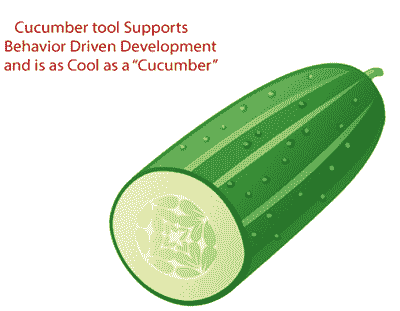
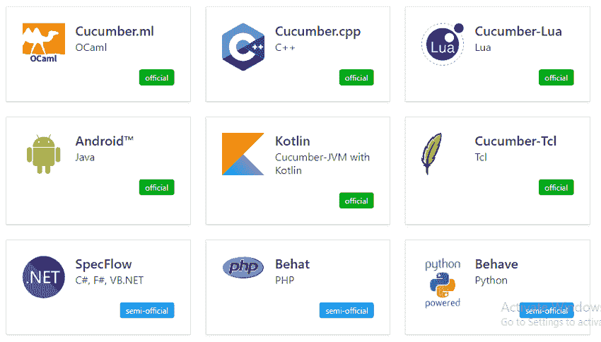

# Cucumber 是什么？

> 原文：<https://www.javatpoint.com/cucumber-testing-introduction>

Cucumber 是一个[行为驱动开发](cucumber-behavior-driven-development)工具，用于开发软件功能行为的测试用例。它在自动化测试中起着辅助作用。

换句话说，

“Cucumber 是测试人员用来开发测试用例的软件工具，用于测试软件的行为。”

Cucumber 工具在开发自动化测试的验收测试用例中起着至关重要的作用。它主要用于根据 web 应用的功能行为编写验收测试。

它遵循 **BDD** (行为驱动开发)框架来观察软件功能的行为。

在 Cucumber 测试中，测试用例是用简单的英文文本编写的，任何人都可以在没有任何技术知识的情况下理解。这个简单的英文文本被称为[小 Cucumber 语言](cucumber-testing-gherkin-language)。

它允许业务分析师、开发人员、测试人员等。以易于阅读和理解的格式(例如，简单英语)自动进行功能验证和确认。

我们可以把 Cucumber 和水提、Selenium、水豚等一起使用。它支持很多其他的语言，像 **PHP** 、 **Net** 、 **Python** 、 **Perl** 等等。

## 什么是 BDD？

BDD(行为驱动开发)是从**测试驱动开发(TDD)** 发展而来的软件开发方法。

BDD 在一个[特征文件](feature-file-in-cucumber-testing)中包含了以简单英语语句形式的测试用例开发，该文件是人工生成的。测试用例语句基于系统的行为，并且更加以用户为中心。

BDD 是用简单的英语语言语句编写的，而不是典型的编程语言，这改善了技术和非技术团队与利益相关者之间的沟通。

## Cucumber 用哪种语言？

**Cucumber**工具最初是用“ **Ruby** ”编程语言编写的。它仅用于测试 Ruby，作为对 **RSpec** BDD 框架的补充。

但是现在，Cucumber 支持多种不同的编程语言，包括 Java、JavaScript、PHP、Net、Python、Perl 等。具有各种实施方式。在 Java 中，它支持**原生 JUnit** 。

## Cucumber 的基本术语

*   特征文件
*   特征
*   标签
*   [场景](test-scenario)
*   小 Cucumber 语言
*   步骤定义

## Cucumber 检测是如何工作的？

Cucumber 测试用例是与软件的代码开发并行编写的。这些测试用例在小 Cucumber 语言中被称为 step。

*   首先，Cucumber 工具读取特征文件中写在小 Cucumber 或纯英文文本中的步骤。
*   现在，它在步骤定义文件中搜索每个步骤的精确匹配。当它找到匹配项时，执行测试用例，并提供通过或失败的结果。
*   开发软件的代码必须与 BDD 定义的测试脚本一致。如果没有，那么就需要进行代码重构。只有在成功执行定义的测试脚本后，代码才会被冻结。

## Cucumber 支持的软件工具

要执行测试的代码可能属于不同的软件工具，如 **Selenium** 、 **Ruby on Rails** 等。但是 Cucumber 几乎支持所有流行的软件平台，这也是 Cucumber 相对于其他框架如 **JDave** 、 **Easyb** 、 **JBehave** 等受欢迎的原因。下面给出了一些 Cucumber 支持的工具:

*   铁轨上的红宝石
*   Selenium
*   微微容器
*   [弹簧骨架](spring-tutorial)
*   沃特沃特 Walter

## Cucumber 工具的优势

*   Cucumber 测试的主要重点是最终用户体验，因为软件的成功最终取决于最终用户体验。
*   测试用例的编写非常简单易懂。
*   与其他工具不同，它提供了一个端到端的测试框架。
*   它支持几乎所有流行的不同语言，如 Java.net、JavaScript Ruby、PHP 等。
*   它充当了业务和技术语言之间的桥梁，并且这种桥梁是可持续的，因为测试用例是用纯英语文本编写的。
*   测试环境的建立和执行都非常快速和容易。
*   这是一个非常有效的测试工具。

* * *