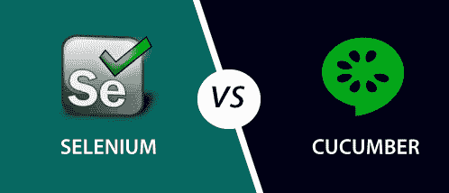

# 黄瓜与Selenium的区别

> 原文：<https://www.javatpoint.com/cucumber-vs-selenium>

在了解黄瓜和Selenium的区别之前，我们先简单介绍一下。

## 黄瓜

这是一个**行为驱动开发**工具，用于开发软件功能行为的测试用例。它在自动化测试中起着辅助作用。

换句话说，黄瓜是一个软件工具，被测试人员用来开发测试用例来测试软件的行为。

黄瓜工具使测试脚本变得非常容易，因为测试用例是用简单的英语文本编写的，任何人都可以在没有任何技术知识的情况下理解。这个简单的英文文本被称为小黄瓜语言。

它允许业务分析师、开发人员、测试人员等。以易于阅读和理解的格式(例如，简单英语)自动进行功能验证和确认。

黄瓜工具可以与各种测试工具一起使用，如 Watir、Selenium 和 Capybara 等。

**黄瓜**工具最初是用“ **Ruby** ”编程语言编写的。它仅用于测试 Ruby，作为对 **RSpec** BDD 框架的补充。

但是现在，黄瓜支持多种不同的编程语言，包括 Java、JavaScript、PHP、Net、Python、Perl 等。具有各种实施方式。在 Java 中，它支持**原生 JUnit** 。

## Selenium

Selenium 是应用最广泛的开源 Web UI(用户界面)自动化测试套件之一。Selenium 支持跨不同浏览器、平台和编程语言的自动化。

Selenium 可以轻松部署在 Windows、Linux、Solaris 和 Macintosh 等平台上。此外，它还支持 iOS、windows、mobile 和 android 等移动应用的操作系统。

Selenium 通过使用特定于每种语言的驱动程序来支持多种编程语言。Selenium 支持的语言包括 **C#** 、 **Java** 、 **Perl** 、 **PHP** 、 **Python** 和 **Ruby** 。目前，Selenium Web 驱动程序最受 Java 和 C#的欢迎。Selenium 测试脚本可以用任何支持的编程语言进行编码，并且可以在大多数现代网络浏览器中直接运行。Selenium 支持的浏览器包括 Internet Explorer、Mozilla Firefox、谷歌 Chrome 和 Safari。

**现在我们来看看黄瓜和Selenium的根本区别:**

| 黄瓜 | Selenium |
| 这是一个**行为驱动开发**工具，用于开发软件功能行为的测试用例。 | 这是一个自动化测试工具。 |
| 黄瓜是一个免费或开源的 BDD(行为驱动开发)工具。 | Selenium也是一个免费或开源的测试工具。 |
| 黄瓜是一个支持 BDD 的工具。 | Selenium是一个功能和性能(Selenium网格)测试工具。 |
| 黄瓜框架支持多种语言，如 Java、Scala、Groovy 等。超越 Ruby。 | Selenium 还支持多种语言，如 Java、。Net 等。 |
| 黄瓜包括测试人员和开发人员来编写自动化步骤。 | 像黄瓜一样，Selenium 也包括测试人员和开发人员来编写自动化步骤。 |
| 黄瓜仅用于测试 web 应用。 | 像黄瓜一样，Selenium 也曾经只测试 web 应用。 |
| 与Selenium和 QTP 相比，黄瓜测试不太可靠。 | Selenium的过程使测试更加可靠。 |
| 黄瓜在插件中工作非常快。 | Selenium在插件中的工作速度比黄瓜慢。 |

* * *