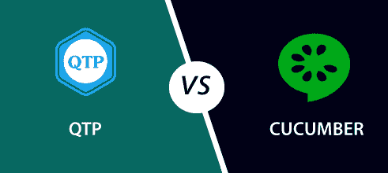

# 黄瓜和 QTP 的区别

> 原文：<https://www.javatpoint.com/cucumber-vs-qtp>

在了解黄瓜和 QTP 的区别之前，我们先简单介绍一下。

## 黄瓜

黄瓜是一个**行为驱动开发**工具，被测试人员用来为软件的行为测试开发测试用例。

黄瓜用小黄瓜语言编写测试脚本。小黄瓜语言是一种简单的英语文本语言，因此任何人都可以在没有任何技术知识的情况下理解它。

它允许开发人员、测试人员、业务分析师等。以易于阅读和理解的格式(例如，简单英语)自动进行功能验证和确认。

**黄瓜**工具最初是用“ **Ruby** ”编程语言编写的。它仅用于测试 Ruby，作为对 **RSpec** BDD 框架的补充。

但是现在，黄瓜支持多种不同的编程语言，包括 Java、JavaScript、Python、PHP、Net、Perl 等。具有各种实施方式。在 Java 中，它支持**原生 JUnit** 。

## 工具

QTP 代表**快测专业**。它是一个软件工具，帮助测试人员执行自动化功能测试。在 QTP，自动化功能测试是在没有任何监控的情况下完成的，并且只在测试脚本开发完成之后进行。QTP 最适合软件应用的回归测试。

QTP 使用 **Visual Basic 脚本语言**对软件应用进行自动化测试。

VBScript 不是面向对象的语言，但它是一种基于对象的语言。

我们不需要专门安装脚本引擎，因为它已经作为视窗操作系统的一部分提供了。

VBScript 的当前版本是 5.8，它是 Windows 7 的一部分。

**现在，我们来看看黄瓜和 QTP 的根本区别:**

| 黄瓜 | 工具 |
| 这是一个**行为驱动开发**工具，用于开发软件功能行为的测试用例。 | 这是一个自动化的功能测试工具。 |
| 黄瓜最适合开发 web 应用的行为。 | QTP 最适合应用的回归测试。 |
| 黄瓜是一个免费或开源的 BDD(行为驱动开发)工具。 | QTP(快速测试专家)是一个昂贵的付费测试工具。 |
| 黄瓜是一个受支持的 BDD 测试工具。 | QTP 是一个自动化测试工具，为功能和回归测试提供自动化测试。 |
| 黄瓜框架支持 Java、Scala、Groovy 等多种语言。超越 Ruby。 | QTP 只支持 VB 脚本。 |
| 黄瓜包括测试人员和开发人员来编写自动化步骤。 | QTP 只包括编写自动化步骤的测试人员。 |
| 黄瓜仅用于测试 web 应用。 | QTP 用于测试网络、桌面和任何客户端-服务器应用。 |
| 与Selenium和 QTP 相比，黄瓜检测不太可靠。 | 它比黄瓜更可靠。 |
| 黄瓜在插件中工作非常快。 | 与黄瓜和Selenium相比，QTP 在 Plugin 中的运行速度较慢。 |

* * *