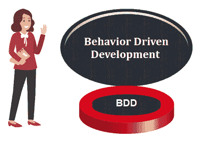
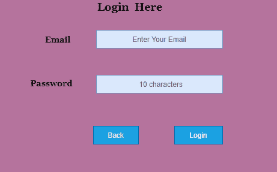

# 行为驱动发展

> 原文：<https://www.javatpoint.com/cucumber-behavior-driven-development>

BDD(行为驱动开发)是从**测试驱动开发(TDD)** 发展而来的**软件开发**方法。

BDD 包括基于软件功能行为的测试用例开发。所有的测试用例都是以简单的英文语句的形式写在一个[特征文件](feature-file-in-cucumber-testing)里面，这个文件是人工生成的。验收测试用例语句完全集中在用户动作上。



BDD 是用简单的英语语句编写的，而不是典型的编程语言。BDD 改善了技术和非技术团队与利益相关者之间的沟通。

让我们通过一个例子来理解，我们如何基于特定函数的行为来开发[测试用例](test-case)。

在下面的例子中，我们将采用一个 web 应用的**登录功能**。

## 示例:

为了保证登录功能的工作，我们正在基于 BDD 开发验收测试用例。



```
Feature: Login Function
To enter in the System  
User must be able to 
Access software when login is successful 
Scenario: Login
Given User has its Email  
And Password  
When User enters the correct Email and Password  
Then It should be logged in
Scenario: Unsuccessful Login
When User enters either wrong Email or Password  
Then It should be reverse back on the login page with an error message

```

## 需要选择 BDD

除非企业主熟悉[单元测试](unit-testing)的使用，否则 TDD 的工作令人满意。而且，他们的技术技能应该足够强，这并不总是可能的。

在这种情况下，BDD 是有利的，因为测试用例是用通用的英语编写的，所有涉众都很容易理解。

熟悉、易于理解的语言是使用 BDD 的最大优势，因为它在技术和非技术团队之间的合作中发挥着至关重要的作用，以更高的效率执行任务。

## BDD 的特点

**强协同**

BDD 为相关各方提供了强有力的合作。这只是因为简单的测试用例是用英语写的。在黄瓜测试中，股东在建设性的讨论中起着至关重要的作用，因为只有他们知道软件的期望。

**高能见度**

由于简单的英语，每个人都能很好地了解项目的进展。

**软件设计遵循商业价值**

BDD 非常重视业务价值和需求。根据客户提供的价值，通过与客户一起设置优先级，开发人员能够给出更好的结果，因为他们非常了解客户的想法。

**无处不在的语言**

如前所述，测试用例是用无处不在的语言编写的，团队的所有成员都可以理解，无论他们是否来自某个技术领域。这有助于减少成员之间对概念的误解和误会。无处不在的语言使得新成员很容易加入工作。

**软件开发满足用户需求。**

BDD 关注的是企业的需求，这样用户才能得到满足，当然，满意的用户意味着业务的增长。对于 BDD，测试人员关注的是比实现更有影响的行为。

**开发商方更有信心**

使用 BDD 的团队通常更有信心，因为他们不会破坏代码，当涉及到他们的工作时，会做更好的预测。

**降低成本**

通过提高代码质量，BDD 基本上降低了维护成本，将项目的风险降到了最低。

* * *