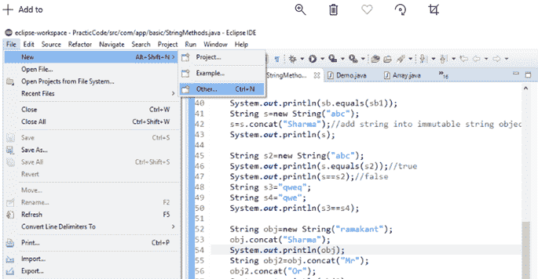
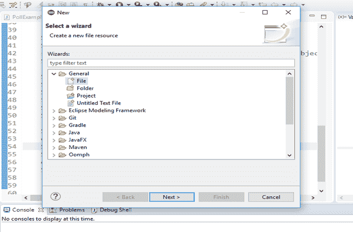
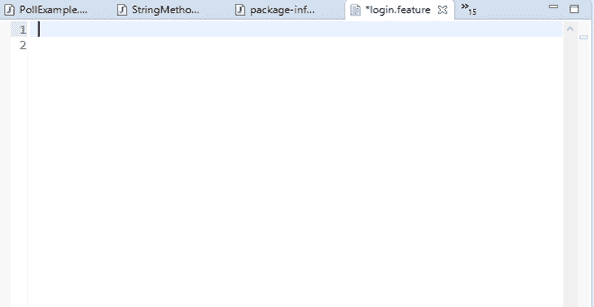

# 如何创建要素文件

> 原文：<https://www.javatpoint.com/cucumber-testing-how-to-create-feature-file>

有几种方法可以在不同的 IDE 中创建特性文件，这里我们在 Eclipse IDE 中创建它。

我们可以用“ ***”创建一个特征文件。*特色**延伸。

以下是使用 **eclipse IDE** 创建特征文件的步骤:

1.要在 eclipse 中创建特征文件，请转到窗口左侧的**文件**选项，然后选择**新建**。

当你点击**新建**时，你会得到以下三个选项:

*   **项目**
*   **例**
*   **其他**

从这三个选项中选择**其他**选项。

### 考虑以下图像:

2.选择**其他**选项后，会得到几个选项，从这些选项中选择**通用<文件**选项，然后点击**下一步**。

### 考虑以下图像:

3.单击**下一步**后，选择要在其中创建特征文件的项目。

选择项目后，可以通过给定名称和“**”来创建要素文件。功能**”扩展。您可以根据自己的选择为要素文件提供任何名称。输入姓名后，点击**完成**按钮。

### 考虑以下图像:

4.现在，创建的要素文件将出现在项目中。

### 考虑以下图像:

生成的特征文件将类似于上面的图像。在其中，我们可以编写要测试的 web 应用程序的特性、场景和特性描述。

* * *