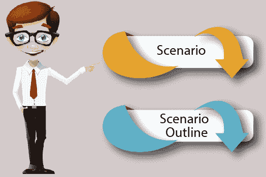

# 黄瓜测试中的场景是什么？

> 原文：<https://www.javatpoint.com/scenario-in-cucumber-testing>

**场景**是小黄瓜语言的核心结构之一。场景包括[功能](feature-in-cucumber-testing)的所有可能情况以及这些情况的测试脚本。

关键字“**场景**”代表[小黄瓜语言](cucumber-testing-gherkin-language)中的一个场景。

一个特性可以有多个场景，每个场景由一个或多个步骤组成。



让我们通过一个例子来理解这个场景:

### 示例:

为了确保网络应用程序的反馈功能，我们正在创建一个黄瓜测试来验证它是否工作。

```
Scenario - Verification of Feedback Functionality
Given the user navigates to JavaTpoint.com
When the user clicks on Feedback, then the Feedback page opens
And the user submits feedback message
Then feedback should be received on the admin page
And admin can reply to the user

```

每个场景遵循**给定**、**当**、**和**、**然后格式化**。这种格式属于一种特殊的语言，称为“**小黄瓜语言**”。

*   **给定:**描述应用程序特定功能的任务。它基本上是测试的一个预先已知的状态或预先条件。
*   **When:** 用来形容动作。例如，当用户尝试登录时，它被认为是一个操作。
*   **然后:**预期结果应该放在这里。例如，成功登录的验证就是一个结果。
*   **和:**我们可以用它来组合两个或多个同类型的动作。例如，用户名和密码属于同一类型，即登录功能。

## 场景大纲

在小黄瓜语言中，场景大纲是用于多次运行同一个场景的关键词。

它也被定义为“当使用不同的值组合多次执行相同的测试时，使用场景大纲。”

关键字场景大纲也可以用**场景模板**来命名。换句话说，关键字场景模板是场景大纲的同义词。

场景大纲与场景结构完全相似，唯一不同的是**提供了多个输入**。为了使用场景大纲，我们不需要任何聪明的想法，我们只需要复制相同的步骤并重新执行代码。

让我们通过一个例子来理解场景大纲:

### 示例:

假设我们需要测试多个用户的登录功能是否正常工作。这种情况需要多次执行登录功能场景。因此，场景大纲可用于测试具有多个用户名和密码的登录功能场景。

在提及小黄瓜语句中的“Username”和“Password”等变量时，请用“ **< >** 提及它们。考虑以下测试脚本:

```
Scenario: Successful Login with Valid entries
Given user navigates to the website javatpoint.com 
When User Navigate to Login Page
And user logs in through Login Window by using <Username> as "username1"
And <Password> as "password1"
Then login must be successful.

```

让我们以上面的测试脚本为例，其中我们需要使用几组不同的用户名和密码来测试登录功能。

```
Feature: Login Functionality  
Scenario Outline: Login functionality
Username | Password
username1 | password1
username2 | password2
username3 | password3
username4 | password4

```

在上面的例子中，我们为变量“用户名”和“密码”提供了多个输入值。在执行实际测试时，黄瓜将用提供的输入值替换变量。

一旦使用 password1 执行了 username1，测试将使用另一个输入值执行第二次迭代。黄瓜将遵循这个路径，直到完成所有提供的值。

#### 注意:一个场景大纲必须包含一个场景部分。场景步骤被解释为模板，从不直接执行。

* * *