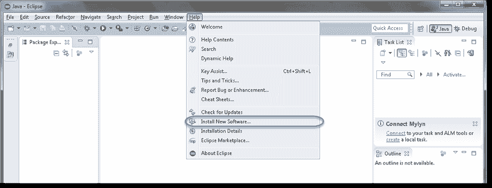
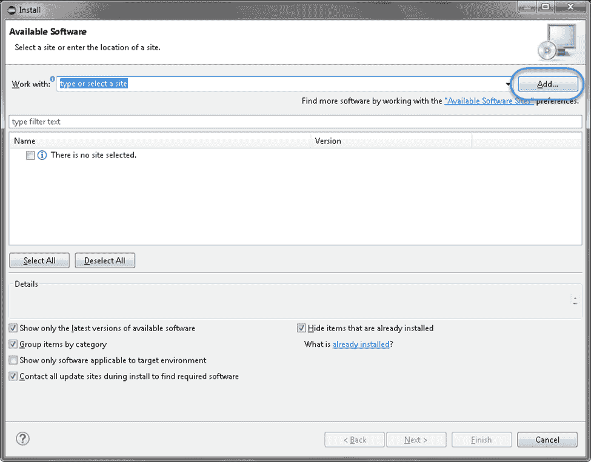
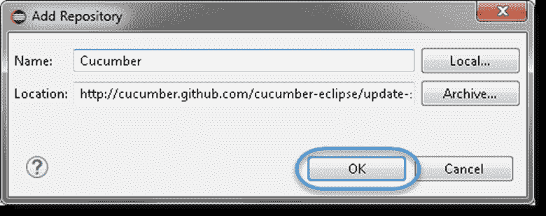
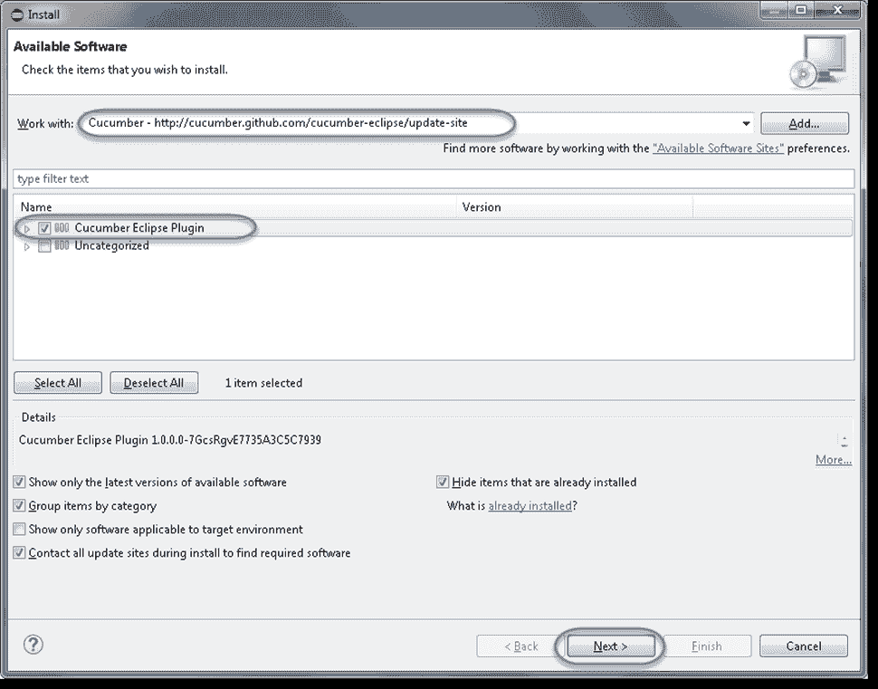
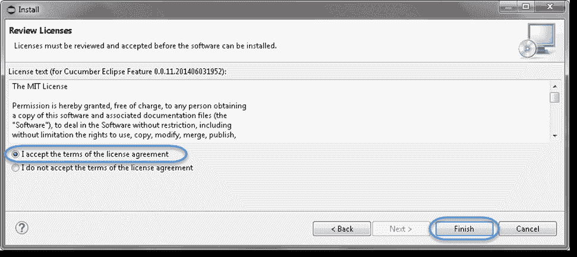
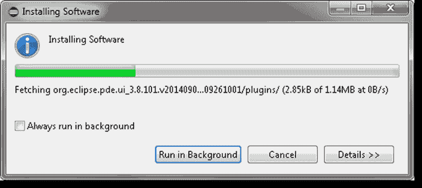

# 安装黄瓜 Eclipse 插件

> 原文：<https://www.javatpoint.com/install-cucumber-eclipse-plugin>

我们只能在插件后才能在 eclipse 中使用黄瓜。为了用 eclipse 插件黄瓜，使用以下步骤:

**第一步**

第一步，确保有良好的互联网连接。现在，启动 **Eclipse IDE** ，然后进入帮助菜单，点击**安装新软件**。

**第二步**

点击**安装新软件**后，会出现一个窗口提示，在该窗口中点击**添加**按钮。

**第三步**

点击**添加**按钮后，根据您的选择在文本框中输入**名称**。我们提供了“**黄瓜**”。

现在，在位置文本框中输入“[http://cucumber.github.com/cucumber-eclipse/update-site](https://cucumber.github.com/cucumber-eclipse/update-site)”作为位置，然后点击**确定**。

**第四步**

现在，你会回到上一个窗口，但这次你会在软件列表中看到“**黄瓜 Eclipse Plugin** ”。只需点击“**复选框**，然后点击“**下一步**按钮。

#### 注意:如果代理服务器在后面运行，那么会出现【需要 HTTP 代理认证】的错误。在这种情况下，您需要联系系统管理员来设置代理服务器设置。

**第五步**

现在，点击**下一步**按钮。

**第 6 步**

单击许可窗口中的复选框“ ***我接受许可协议的条款*** ，然后单击**完成**。

**第 7 步**

现在，安装将开始。完成可能需要一些时间。

**第 8 步**

如果遇到安全警告，只需点击**确定**。

**第 9 步**

安装已经完成，现在只需点击**是**按钮。

* * *