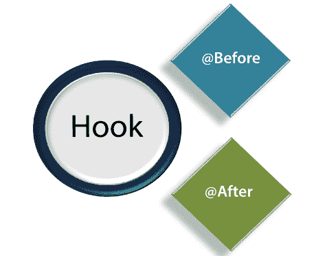

# 黄瓜里的钩子是什么？

> 原文：<https://www.javatpoint.com/hook-in-cucumber>

在黄瓜中，**钩子是代码块**，可以在步骤定义文件中用注释**@在**之前和**@在**之后来定义。这些@Before 和@After 注释创建了一个我们可以编写代码的块。



黄瓜**钩子**方便我们更好的处理代码工作流，也帮助我们减少代码冗余。

**语法:**

```

@Before setup ()
{  
logic 

   } @

Scenario
Given
When
And
Then

@After cleanup (){  
      logic  
   }  

```

按照代码逻辑，hook 的工作是在特定的函数/方法之后启动和关闭 web 驱动程序会话。因此，实际上，它与任何功能/方法或场景无关。

#### 注意:钩子只能在步骤定义文件中定义。

## 钩子的需要

在测试的时候，我们可能会遇到这样的情况:在测试场景之前，我们需要执行一些常规的先决步骤。

考虑以下先决条件，以了解测试时可能遇到的先决条件类型:

*   要启动网络驱动程序
*   数据库连接的设置
*   测试数据的设置
*   浏览器 cookies 的设置
*   导航到某个页面

同样，测试后总会遇到一些先决步骤:

*   要停止网络驱动程序
*   关闭数据库连接
*   清除测试数据
*   清除浏览器 cookies
*   从应用中注销
*   打印报告或日志
*   拍摄错误截图

为了处理这些类型的常规先决步骤，使用黄瓜钩是最好的选择。

## 挂钩注释

与 TestNG 注释不同，黄瓜只支持两个钩子:

*   **@之前**
*   **@在**之后

**@之前**

顾名思义，我们可以使用 **@Before** 挂钩函数/方法，之后我们需要启动 web 驱动程序。

**@在**之后

顾名思义，我们可以使用 **@After** 挂钩函数/方法，之后我们需要关闭 web 驱动程序。

让我们通过一个步骤定义文件的例子来更好地理解这个概念。

### 示例:

这是一个 **Maven 测试项目**的步骤定义文件的实例。这个项目是为测试网络应用 javaTpoint 而创建的。

为了使用钩子，我们在包**下创建了名为**hookTest.java**的步骤定义文件**。

```

package javatpointTest;  

import org.openqa.selenium.By;  
import org.openqa.selenium.WebDriver;  
import org.openqa.selenium.firefox.FirefoxDriver;  

import cucumber.annotation.en.Given;  
import cucumber.annotation.en.Then;  
import cucumber.annotation.en.When;  

public class hookDemo { 
   WebDriver driver = null;  

   @Before public void setUp(){  
      driver = new FirefoxDriver();  
   }  

   @Given("^User navigates to javatpoint$")  
   public void goToFacebook() {  
      driver.navigate().to("https://www.javatpoint.com/"); 
   }  

  @When("^ user enter Username as \"([^\"]*)\" and Password as \"([^\"]*)\"$" ")  
   public void User_enter_Username_and_Password(String arg1, String arg2) { 
      driver.findElement(By.id("emailAddress")).sendKeys(arg1); 
      driver.findElement(By.id("password")).sendKeys(arg2); 
      driver.findElement(By.id("u_0_v")).click();  
   }  

   @Then("^login should be unsuccessful$")  
   public void validateRelogin() {  
      if(driver.getCurrentUrl().equalsIgnoreCase( 
         "https://www.javatpoint.com/login.php?login_attempt=1&lwv=110")){  
            System.out.println("Test Pass");  
      } else {  
         System.out.println("Test Failed");  
      }  
      driver.close();  
   }  

   @After public void cleanUp(){  
      driver.close();  
   }  
} 

```

当我们执行这段代码时，执行顺序如下:

*   开始时， **@Before** 注释将设置 web 驱动程序和执行测试所需的其他先决条件。
*   设置网络驱动程序和其他先决条件后，将执行**给定的**语句。
*   执行完**给定的**语句后，将执行【T2 时】语句。
*   执行 **When** 语句后，将执行 **Then** 语句。
*   现在最后，**@在**之后，钩子将**关闭**网页驱动程序并进行清理过程。

既然我们知道，要执行步骤定义文件，我们应该有一个完整的 **Maven 测试项目**，所以首先在 eclipse 中创建它。

## 标记挂钩

这个钩子也可以和标签一起使用。我们可以使用之前的**@和**之后的**@进行特定的测试。**

**示例:**

```

@Before ('@RegressionTest)

@After ('@RegressionTest)

```

我们也可以使用与逻辑 and/or 运算符相同的钩子概念。

**示例:**

```

@Before ('@RegressionTest, @SmokeTest)

@ After ('@RegressionTest, @SmokeTest)

```

* * *