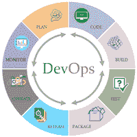
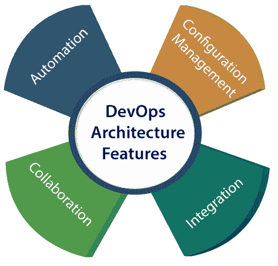

# DevOps 教程

> 原文：<https://www.javatpoint.com/devops>

DevOps 是两个词的组合，一个是**开发**，另一个是**运营**。它是一种集体推动发展和运营过程的文化。

DevOps 教程将帮助您学习 DevOps 基础知识，并提供各种 DevOps 工具的深度知识，如 **Git、Ansible、Docker、Puppet、Jenkins、Chef、Nagios** 和 **Kubernetes** 。

## 什么是 DevOps？

DevOps 是两个词的组合，一个是软件开发，第二个是运营。这允许单个团队处理整个应用生命周期，从开发到**测试、部署**和**操作**。DevOps 帮助您减少软件开发人员、质量保证(QA)工程师和系统管理员之间的脱节。

DevOps 促进开发和运营团队之间的协作，以自动化和可重复的方式更快地将代码部署到生产中。

DevOps 有助于提高组织交付应用和服务的速度。它还允许组织更好地为客户服务，并在市场上更有力地竞争。

DevOps 也可以定义为一系列具有更好的沟通和协作的开发和 IT 操作。

DevOps 已经成为企业或组织最有价值的商业学科之一。在 DevOps 的帮助下，应用交付的**质量**、**速度**都有了很大程度的提升。

DevOps 只不过是让“T0”开发人员和“T2”运营人员一起工作的一种实践或方法。DevOps 代表了信息技术文化的变化，通过在面向系统的方法中采用敏捷实践，完全专注于快速的信息技术服务交付。

DevOps 是关于运营和开发过程的集成。采用 DevOps 的组织注意到软件质量提高了 22%，应用部署频率提高了 17%，客户满意度提高了 22%。由于 DevOps 的成功实施，收入增长了 19%。

## 为什么是 DevOps？

在继续之前，我们需要理解为什么我们需要 DevOps 而不是其他方法。

*   运营和开发团队完全孤立地工作。
*   在设计-构建之后，分别执行测试和部署。这就是为什么它们比实际的构建周期消耗更多的时间。
*   如果不使用 DevOps，团队成员将花费大量时间在设计、测试和部署上，而不是构建项目上。
*   手动代码部署会导致生产中的人为错误。
*   编码和操作团队有各自独立的时间表，并且不同步，导致进一步的延迟。

## 德文普斯历史

*   2009 年，第一次名为 **DevOpsdays** 的会议在比利时根特举行。比利时顾问和帕特里克·德比斯创办了这次会议。
*   2012 年，岚娜·布朗在 Puppet 剧院发起并构思了《德文普斯现状报告》。
*   2014 年，尼科尔·福斯格伦、杰斯·亨布尔、吉恩·金等人发表了年度《德文普斯现状》报告。他们发现 DevOps 的采用在 2014 年也在加速。
*   2015 年，妮可·福斯格伦(Nicole Forsgren)、吉恩·金(Gene Kim)和杰斯·汉布尔(Jez Humble)创立了朵拉(DevOps Research and Assignment)。
*   2017 年，Nicole Forsgren、Gene Kim 和 Jez Humble 出版了《加速:构建和扩展高性能技术组织》。

## DevOps 架构特性

下面是 DevOps 架构的一些关键特性，例如:

### 1)自动化

自动化可以减少时间消耗，尤其是在测试和部署阶段。生产率提高了，自动化使发布变得更快。这将导致快速捕获 bug，以便可以轻松修复。对于连续交付，每个代码都是通过自动化测试、基于云的服务和构建来定义的。这使用自动化部署来促进生产。

### 2)协作

开发和运营团队作为 DevOps 团队进行合作，随着团队的生产力提高，这将改善文化模式，从而加强问责制和所有权。团队分担责任并紧密同步地工作，这反过来又使生产部署更快。

### 3)整合

应用需要与环境中的其他组件集成。集成阶段是将现有代码与新功能相结合，然后进行测试。持续集成和测试支持持续开发。发布和微服务的频率会带来巨大的运营挑战。为了克服这些问题，实施持续集成和交付，以**更快、更安全的**和**可靠的方式**交付。

### 4)配置管理

它确保应用只与那些与它运行的环境相关的资源进行交互。配置文件不是在应用的外部配置与源代码分离的地方创建的。配置文件可以在部署期间写入，也可以在运行时加载，具体取决于运行环境。

## DevOps 的优点和缺点

以下是 DevOps 对业务的一些优势和劣势，例如:

### 优势

*   DevOps 是快速开发和部署应用的优秀方法。
*   它能更快地响应市场变化，提高业务增长。
*   DevOps 通过减少软件交付时间和运输成本来提升业务利润。
*   DevOps 清除了描述性流程，这使得产品开发和交付更加清晰。
*   它提高了客户体验和满意度。
*   DevOps 简化了协作，并将所有工具放在云中供客户访问。
*   DevOps 意味着集体责任，这会带来更好的团队参与度和生产力。

### 不足之处

*   DevOps 的专业或专家开发人员较少。
*   用 DevOps 开发太贵了。
*   在行业中采用新的 DevOps 技术很难在短时间内实现。
*   缺乏 DevOps 知识可能是自动化项目持续集成中的一个问题。

## 先决条件

学习 DevOps，你要有 **Linux** 的基础知识，至少有一门**脚本语言**。

## 观众

我们的 DevOps 教程旨在帮助初学者和专业人士。

## 问题

我们向您保证，您不会发现本 DevOps 教程有任何问题。但如果有任何错误或差错，请在联系表中注明。

* * *