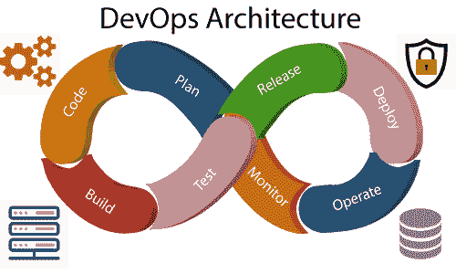
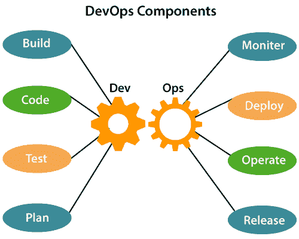

# 德沃普斯建筑

> 原文：<https://www.javatpoint.com/devops-architecture>

为了交付应用，开发和运营都扮演着重要的角色。部署包括分析软件组件或框架的**需求、设计、开发**和**测试**。

操作包括软件的管理过程、服务和支持。当开发和运营都与协作相结合时，那么 DevOps 架构就是解决部署和运营之间的差距的方案；因此，交货可以更快。

DevOps 架构用于云平台上托管的应用和大型分布式应用。敏捷开发被用在 DevOps 架构中，这样集成和交付可以是连续的。当开发和运营团队各自独立工作时，那么**设计、测试**、**部署**都是很费时间的。如果条款彼此不同步，那么可能会导致交货延迟。因此，DevOps 使团队能够改变他们的缺点并提高生产率。

以下是 DevOps 体系结构中使用的各种组件:

### 1)构建

如果没有 DevOps，资源消耗的成本将根据预先定义的固定硬件分配的个人使用情况进行评估。而有了 DevOps，云的使用、资源的共享就有了眉目，构建取决于用户的需求，这是一种控制资源或容量使用的机制。

### 2)代码

许多好的实践，如 Git，使得代码能够被使用，这确保了为业务编写代码，有助于跟踪变化，得到关于实际和预期输出差异背后的原因的通知，并且如果必要的话，恢复到开发的原始代码。代码可以适当排列在**文件、文件夹**等中。它们可以重复使用。

### 3)测试

该应用将在测试后准备好投入生产。在手动测试的情况下，测试和将代码移动到输出会消耗更多的时间。测试可以是自动化的，这减少了测试的时间，从而可以减少将代码部署到生产中的时间，因为自动化脚本的运行将消除许多手动步骤。

### 4)计划

DevOps 使用敏捷方法来计划开发。随着运营和开发团队的同步，它有助于组织工作进行相应的规划，以提高生产率。

### 5)监控

持续监控用于识别任何故障风险。此外，它有助于准确跟踪系统，以便检查应用的运行状况。对于日志数据可能通过许多第三方工具(如 **Splunk** )进行监控的服务，监控变得更加舒适。

### 6)部署

许多系统可以支持自动部署的调度程序。云管理平台使用户能够获得准确的见解，并通过部署仪表板来查看优化场景和趋势分析。

### 7)操作

DevOps 改变了传统的分别开发和测试的方式。团队以协作的方式运作，两个团队都积极参与整个服务生命周期。运营团队与开发人员互动，他们提出一个监控计划，服务于信息技术和业务需求。

### 8)释放

部署到环境中可以通过自动化来完成。但是当部署到生产环境时，它是通过手动触发来完成的。发布管理中涉及的许多过程通常用于在生产环境中手动进行部署，以减少对客户的影响。

* * *