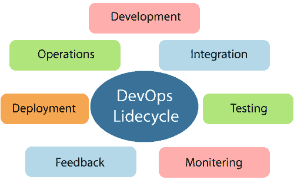
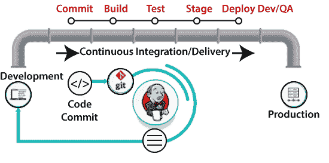
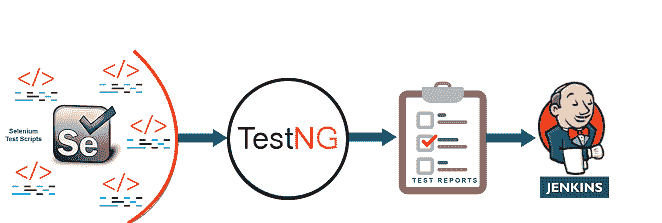
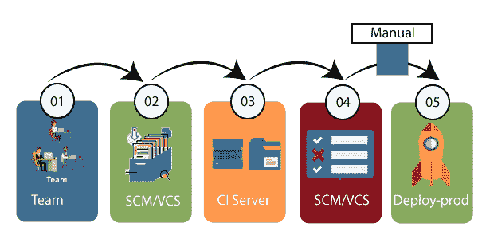

# 开发生命周期

> 原文：<https://www.javatpoint.com/devops-lifecycle>

DevOps 定义了运营和开发之间的敏捷关系。这是一个由开发团队和运营工程师从产品的开始到最后阶段共同实践的过程。

如果不了解 DevOps 的生命周期阶段，学习 DevOps 是不完整的。DevOps 生命周期包括以下七个阶段:

### 1)持续发展

这个阶段包括软件的规划和编码。项目的远景是在规划阶段决定的。开发人员开始为应用开发代码。没有规划所需的 DevOps 工具，但是有几个工具可以维护代码。

### 2)持续集成

这个阶段是整个 DevOps 生命周期的核心。这是一种软件开发实践，在这种实践中，开发人员需要更频繁地提交对源代码的更改。这可能是每天或每周的。然后构建每个提交，如果存在问题，这允许早期检测问题。构建代码不仅涉及编译，还包括**单元测试、集成测试、代码评审**、**打包**。

支持新功能的代码与现有代码持续集成。因此，软件不断发展。更新后的代码需要与系统持续平滑地集成，以向最终用户反映变化。

詹金斯是这个阶段使用的一个流行工具。每当 Git 存储库中有变化时，Jenkins 就会获取更新的代码，并准备该代码的构建，它是一个 war 或 jar 形式的可执行文件。然后，这个构建被转发到测试服务器或生产服务器。

### 3)持续测试

这一阶段，开发的软件持续测试错误。对于持续测试，使用 **TestNG、JUnit、Selenium** 等自动化测试工具。这些工具允许 QAs 并行彻底测试多个代码库，以确保功能没有缺陷。在此阶段， **Docker** 容器可用于模拟测试环境。

**Selenium**进行自动化测试，TestNG 生成报告。整个测试阶段可以在名为**詹金斯**的持续集成工具的帮助下实现自动化。

自动化测试为执行测试节省了大量的时间和精力，而不是手动完成。除此之外，报告生成是一大优势。评估测试套件中失败的测试用例的任务变得更加简单。此外，我们可以在预定义的时间安排测试用例的执行。测试之后，代码会不断与现有代码集成。

### 4)持续监控

监控是一个涉及整个 DevOps 流程的所有操作因素的阶段，在这个阶段中，关于软件使用的重要信息被记录下来，并被仔细处理以发现趋势和识别问题区域。通常，监控集成在软件应用的操作能力中。

它可能以文档文件的形式出现，也可能在处于连续使用状态时产生关于应用参数的大规模数据。服务器不可达、内存不足等系统错误在此阶段得到解决。它维护服务的安全性和可用性。

### 5)持续反馈

通过分析软件运行的结果，应用开发得到了持续的改进。这是通过在当前软件应用的操作和下一个版本的开发之间放置持续反馈的关键阶段来实现的。

连续性是 DevOps 中的基本因素，因为它消除了开发软件应用所需的不必要步骤，使用它来发现问题，然后产生更好的版本。它扼杀了应用可能带来的效率，并减少了感兴趣的客户数量。

### 6)持续部署

在这个阶段，代码被部署到生产服务器。此外，确保代码在所有服务器上正确使用也很重要。

新代码持续部署，配置管理工具在频繁快速执行任务方面发挥着重要作用。以下是这一阶段常用的一些工具，如**大厨、Puppet、Ansible** 、**盐栈**。

容器化工具在部署阶段也发挥着重要作用。**流浪汉**和**码头工人**是用于此目的的流行工具。这些工具有助于在开发、试运行、测试和生产环境中产生一致性。它们还有助于温和地扩大和缩小实例。

容器化工具有助于在测试、开发和部署应用的环境中保持一致性。生产环境中不会出现错误或失败，因为它们打包并复制了测试、开发和试运行环境中使用的相同依赖项和包。它使应用易于在不同的计算机上运行。

### 7)持续运营

所有 DevOps 运营都基于发布流程完全自动化的连续性，并允许组织持续加快整体上市时间。

从讨论中可以清楚地看出，连续性是 DevOps 中的关键因素，因为它消除了经常分散开发注意力的步骤，花费了更长的时间来发现问题，并在几个月后生产出更好的产品版本。借助 DevOps，我们可以使任何软件产品更加高效，并增加对您的产品感兴趣的客户总数。

* * *