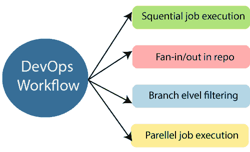

# DevOps 工作流

> 原文：<https://www.javatpoint.com/devops-workflow-and-principles>

DevOps 工作流提供了输入顺序的可视化概述。此外，它还告知执行哪一个操作，并为操作流程生成输出。

DevOps 工作流允许分离和安排用户最需要的工作。此外，它还提供了在配置作业中镜像理想流程的能力。

* * *

## 德文普斯原则

DevOps 的主要原则是持续交付、自动化和对反馈的快速反应。

1.  **End to End 责任:** DevOps 团队需要提供绩效支持，直到他们成为生命的终结。它增强了工程产品的责任和质量。
2.  **持续改进:** DevOps 文化注重持续改进，最大限度减少浪费。它不断加快所提供的产品或服务的增长。
3.  **自动化一切:**自动化是 DevOps 流程的一个基本原则。这是为了软件开发，也是为了整个基础设施。
4.  **以客户为中心的行动:** DevOps 团队必须以客户为中心，因为他们应该持续投资于产品和服务。
5.  **监控和测试一切:**devo PS 团队需要有强大的监控和测试程序。
6.  **作为一个团队工作:**在 DevOps 文化中，设计者、开发人员和测试人员的角色已经被定义。他们所需要做的就是作为一个团队完全协作地工作。

这些原则是通过几种 DevOps 实践实现的，包括频繁部署、质量保证自动化、持续交付、尽早验证想法以及团队内协作。

### 发展业务实践

一些已确定的 DevOps 实践包括:

*   自助服务配置
*   连续构建
*   连续累计
*   连续交货
*   增量测试
*   自动供应
*   自动化发布管理

* * *

* * *