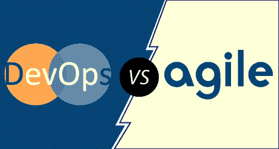

# DevOps 与敏捷

> 原文：<https://www.javatpoint.com/devops-vs-agile>

DevOps 和 Agile 是两种目标相似的软件开发方法，可以尽可能快速高效地获得最终产品。虽然许多组织都希望采用这些实践，但这两种方法之间往往存在一些混淆。

每种方法包含什么？它们在哪里重叠？他们能一起工作吗，还是我们应该选择一个而不是另一个？

在继续之前，先看一下 DevOps 和 Agile。

## 什么是 DevOps？

DevOps 是两个词的组合，一个是软件开发，第二个是运营。这允许单个团队处理整个应用程序生命周期，从开发到**测试、部署**和**操作**。DevOps 帮助您减少软件开发人员、质量保证(QA)工程师和系统管理员之间的脱节。

DevOps 促进开发和运营团队之间的协作，以自动化和可重复的方式更快地将代码部署到生产中。

DevOps 有助于提高组织交付应用程序和服务的速度。它还允许组织更好地为客户服务，并在市场上更有力地竞争。

DevOps 也可以定义为一系列具有更好的沟通和协作的开发和 IT 操作。

DevOps 已经成为企业或组织最有价值的商业学科之一。在 DevOps 的帮助下，应用交付的**质量**、**速度**都有了很大程度的提升。

DevOps 只不过是让“T0”开发人员和“T2”运营人员一起工作的一种实践或方法。DevOps 代表了信息技术文化的变化，通过在面向系统的方法中采用敏捷实践，完全专注于快速的信息技术服务交付。

## 什么是敏捷？

敏捷涉及到 **SDLC** 过程中开发和测试的持续迭代。与瀑布模型不同，开发和测试活动是并发的。这种软件开发方法强调增量、迭代和进化开发。

它将产品分割成小块，并整合在一起进行最终测试。可以通过多种方式实现，如**看板、XP、Scrum** 等。

敏捷软件开发关注四个核心价值，例如:

*   综合文档上的工作软件。
*   响应计划变更。
*   合同谈判中的客户合作。
*   个人和团队在流程和工具上的互动。

**下面是 DevOps 和 Agile 的一些本质区别:**

| 参数 | DevOps | 敏捷 |
| 定义 | DevOps 是将开发和运营团队聚集在一起的实践。 | 敏捷指的是持续迭代的方法，它专注于协作、客户反馈、小规模和快速发布。 |
| 目的 | DevOps 的目的是管理端到端的工程流程。 | 敏捷的目的是管理复杂的项目。 |
| 工作 | 它专注于持续的测试和交付。 | 它专注于不断的变化。 |
| 团队规模 | 它有一个大的团队规模，因为它涉及所有的堆栈持有人。 | 它的团队规模很小。团队越小，工作的人就越少，这样他们可以走得更快。 |
| 团队技能集 | DevOps 在开发和运营团队之间划分和传播技能集。 | 敏捷开发强调训练所有团队成员拥有各种相似和平等的技能。 |
| 履行 | DevOps 专注于协作，因此它没有任何普遍接受的框架。 | 敏捷可以在一系列战术框架内实现，例如 **safe、scrum** 和 **sprint** 。 |
| 持续时间 | 理想的目标是每天或每隔几个小时将代码交付给产品。 | 敏捷开发是以冲刺为单位进行管理的。所以这个时间对于每次冲刺来说都少了一个月。 |
| 目标区域 | 端到端业务解决方案和快速交付。 | 软件开发。 |
| 反馈 | 反馈来自内部团队。 | 在敏捷中，反馈来自客户。 |
| 左移原理 | 它支持左右两种变体。 | 它只支持左移。 |
| 焦点 | DevOps 侧重于运营和业务准备。 | 敏捷侧重于功能性和非功能性准备。 |
| 重要 | 在 DevOps 中，开发、测试和实现都同样重要。 | 开发软件是敏捷所固有的。 |
| 质量 | DevOps 有助于通过自动化和早期 bug 消除来创建更好的质量。开发人员需要遵循编码和最佳架构实践来维护质量标准。 | 敏捷开发出具有所需需求的更好的应用程序套件。它可以根据项目生命周期内按时做出的变化快速适应。 |
| 工具 | **Puppet、厨师、AWS、Ansible** 、团队城市 OpenStack 都是很受欢迎的 DevOps 工具。 | **Bugzilla、Kanboard、JIRA** 都是一些比较流行的敏捷工具。 |
| 自动化 | 自动化是 DevOps 的首要目标。它的工作原理是在部署软件时最大限度地提高效率。 | 敏捷不强调自动化。 |
| 沟通 | DevOps 沟通涉及规格和设计文件。对于运营团队来说，充分了解软件版本及其网络含义对于充分运行部署流程至关重要。 | Scrum 是实现敏捷软件开发最常见的方法。Scrum 会议每天都在进行。 |
| 文件 | 在 DevOps 中，过程文档是最重要的，因为它将把软件发送给操作团队进行部署。自动化最小化了文档不足的影响。然而，在复杂软件的开发中，很难转移所有需要的知识。 | 敏捷方法优先考虑工作系统，而不是完整的文档。当你灵活且反应灵敏时，这是理想的选择。但是，当您试图将事情移交给另一个团队进行部署时，这可能会造成伤害。 |

* * *