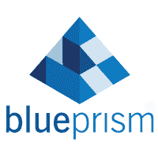
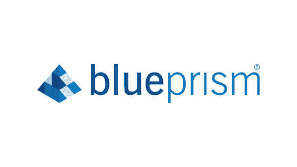
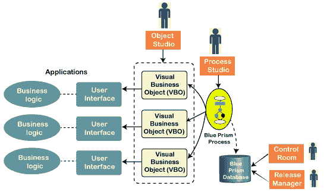
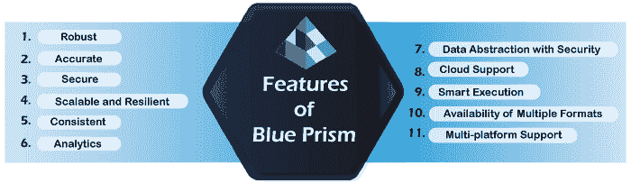

# 蓝色棱镜教程

> 原文：<https://www.javatpoint.com/blue-prism>

我们的蓝棱镜教程提供了蓝棱镜的基本和高级概念。本教程旨在帮助初学者和专业人士。

本教程为您介绍了 Blue Prism，以及诸如**为什么使用 Blue Prism、Blue Prism 的历史、Blue Prism 的架构、Blue Prism 的特点、Blue Prism 的组件、使用 Blue Prism 的好处、安装**等广泛的主题。

## 蓝色棱镜

Blue Prism 是一家总部位于英国的自动化领域的软件开发公司。该公司推出了一款领先的 [RPA 工具](https://www.javatpoint.com/rpa-tools)，也叫蓝棱镜。Blue Prism 工具主要用于开发软件机器人，帮助自动化日常任务和消除手工工作。术语 [RPA](https://www.javatpoint.com/rpa) 是“RPA”的首字母缩写，由蓝棱镜集团首次提出。

Blue Prism 通过自动化重复性的、基于规则的手动后台任务，帮助业务运营变得敏捷且经济高效。Blue Prism 利用“数字劳动力”取代了人工劳动力，从而提高了准确性、安全性、合规性和弹性。该工具基于 [Java 编程语言](https://www.javatpoint.com/java-tutorial)，并提供了一个易于使用的可视化设计器界面。它允许我们使用类似流程图的界面和基本的拖放功能来逐步自动化业务流程。

## 蓝色棱镜的历史

Blue Prism 最初是由一些过程自动化专业人员在 2001 年推出的。Blue Prism 的主要目标是引入一种技术，该技术可以提供数字化劳动力，并提高业务流程的效率和有效性。首先，Blue Prism 专注于后台流程，因为流程自动化有一个巨大的需求没有得到满足。该公司由**大卫·莫斯**和**阿拉斯泰尔·巴斯盖特**共同创立，他们提供了一种可以像人类一样进行体力劳动的技术。这种方法被称为 RPA 或RPA。

早在 2003 年，蓝棱镜就推出了第一款名为“自动化”的商业产品。公司一直在努力提高产品质量。2005 年，该公司推出了 Automate 的第二个版本，其更高级的特性是为大规模处理而明确发布的。它帮助蓝棱镜获得了客户的积极影响和信任。因此，大多数合作金融服务开始使用蓝棱镜来自动化他们的客户服务业务任务。

由于持续改进和遵循自上而下的方法，Blue Prism 帮助企业以敏捷和经济高效的方式自动化其业务流程，并减少了总体人力和时间表。

## 为什么是蓝色棱镜

凭借其强大的数字劳动力和自学的视觉设计师界面，Blue Prism 不断帮助用户实现数十亿流程的自动化。该工具比竞争对手更具优势，因为它具有更好的灵活性、安全性、可扩展性、合规性和弹性。除此之外，蓝棱镜还有一些终端客户正在获得的独特功能。这些功能正在帮助用户提高工作效率，并节省数亿工作时间。

蓝色棱镜是唯一一个:

*   不需要 IT 技能来实施。
*   不需要任何编码技能或编程知识。
*   可以在很短的时间内实现(根据自动化过程的复杂性，通常为 4 到 8 周)。
*   与市场上的其他 RPA 工具相比，成本低且价格合理。
*   可以在 IT 基础架构和流程中实施，而无需对现有环境进行更改。
*   创建软件机器人并支持企业规模和工业长度的数字化劳动力。
*   提供高达 80%甚至更高的巨大投资回报率。
*   提供自我融资回报的出色回报。

## 蓝色棱镜的组件

蓝棱镜共有四个主要组件，例如:

*   流程图
*   流程工作室
*   对象工作室
*   应用建模器

### 流程图

流程图被定义为业务流程的工作流，充当程序。因为 Blue Prism 是一个基于 Java 的 RPA 工具，所以这些图表可以利用核心概念和编程基础知识，并像流程图一样创建整个操作工作流。这些流程图只是工作流的图形表示，有助于分析、创建、修改或扩展整体业务能力。

工作流中的流程使我们能够实现自动化，就像人类手动操作它们一样。但是，这些过程是基于数字劳动力和使用软件机器人的逻辑。软件机器人的行为方式与人类与应用和系统活动交互的方式相同，遵循一系列步骤来实现所需的结果。

### 流程工作室

蓝棱镜中允许我们创建流程图的区域被称为流程工作室。所有过程都以类似流程图的方式显示。它是 Blue Prism 的主要组件之一，因为它包含变量、业务逻辑、控制循环、对象调用等核心特性。所有这些都可以在任何业务流程中连续使用，并且可以完美地测试。创建的流程可以被认为是对人类的描述。

除此之外，流程还可以包含与其他系统应用交互以获得所需结果所需的一系列步骤。我们使用 Process Studio 创建的每个流程都包含主页面，该页面首先执行。

### 对象工作室

企业的基本要求之一是与外部应用进行交互和通信，以高效地自动化其业务流程。无法使用 Process Studio 满足这一需求；因此，Blue Prism 提供了另一个名为 Object Studio 的组件。对象工作室是使我们能够创建可视化业务对象的模块，通常被称为 VBO。这些对象只不过是帮助与外部业务应用交互的图表程序。

在这个组件中，一个业务对象负责提供只能与一个外部应用交互的接口。与 Process Studio 不同，Object Studio 中的每个对象都不包含主页。此外，它还包含两个默认页面，它们被组织为一个平面组。

### 应用建模器

应用建模器是对象工作室中的嵌入式功能。它通常用于使用 Object Studio 创建应用模型。它包括与现有应用和用户界面元素交互所需的配置。这些元素由软件机器人基于指定的属性来识别。这些元素被进一步配置和更新，以使它们对于每个元素都是唯一的。然后，软件机器人可以与这些元素交互，并对它们执行指定的操作。

## 蓝色棱镜建筑

RPA 蓝棱镜的架构可以分为以下四个要素:

*   流程工作室
*   对象工作室
*   控制室
*   发布管理器

### 流程工作室

说到蓝棱镜架构，Process Studio 是最有用的元素。它使企业能够创建最佳的自动化流程。它帮助设计、构建、测试和修改蓝棱镜工具中的自动化流程。这些过程被设计成可以从相关对象中重用。

在 Blue Prism 中，大多数流程非常相似，它们遵循相同的自动化结构。我们可以根据项目的需求随时调用和处理对象。Process Studio 的主要功能是提供动态、可重用和灵活的顺序流程。为了实现这一功能，流程配置了业务逻辑，并在尽可能短的时间内获得结果。Process Studio 有几个组件，允许我们高效地自动化复杂的业务流程。

*   业务对象库根据项目的需求进行对比

*   这些动作和活动是使用拖放功能在一个顺序的、定义良好的结构化工作流表示中实现的。
*   这些操作是通过控制循环、业务逻辑和对象调用的组合插入的。这些操作在流程层的层次结构中进一步控制。
*   动作和活动是按顺序定义的，并在用户始终可见的流程中进行测试。

### 对象工作室

对象工作室是蓝棱镜架构中的另一个基本元素。它主要用于我们需要蓝色棱镜中可以多次使用的对象时。这些可重用对象通常被视为复杂业务流程自动化的构建块。这种方法有助于使用现有对象，并在当前应用和外部应用中实现它们。

除此之外，Blue Prism 中还有几个默认对象可以直接用于自动化各种任务。它们也可以在需要时修改。这些默认对象旨在实现基本系统任务的自动化。

*   借助 Object Studio 的系统元素，几乎所有的应用都可以很容易地建模和进一步探索，以构建多个屏幕的阵列。
*   开发人员可以将所有必需的交互直接封装到节点中。这是在蓝棱镜自动化方法中使用对象工作室遵循的最关键的操作之一。
*   很少有其他常用的操作包括更改字段、全面验证数据和描述数据等。
*   最好的是用户可以控制这些动作并多次回忆。

### 控制室

蓝棱镜架构中的控制室被定义为指挥中心。这意味着它可以用于控制、监控、调度和执行数字化劳动力的自动化流程。

换句话说，蓝棱镜架构中的所有资源都是通过控制室进行监控的。控制室只不过是蓝色棱镜工具内的一个集中管理控制台，显示整个流程工作流的见解。它允许我们通过手动方式检查流程的启动和整个工作，这意味着我们可以选择特定的信息进行详细的统计，以确保正常工作。

*   控制室中的进程调度使得某些进程(冗长的)的执行更加容易，因为当系统理想时，这些进程可以被调度为自动执行。
*   控制室显示软件机器人当前正在做什么、以什么速度以及它们有多有效的实时统计数据和见解。
*   它还提供运行日志，精确定义软件机器人执行了哪些操作。它还将涵盖由于任何原因而无法执行的行动和活动。

### 发布管理器

蓝棱镜架构中的发布管理器主要负责执行主要目的是发布自动化流程的活动。它还有助于自动化和简化与管理相关的功能。简而言之，它用于跨各种 Blue Prism 环境管理、导入、验证和导出配置包。此外，发布管理器提供了创建、删除和修改包的选项。它包含以前创建和导入的软件包版本的详细信息。

*   它包含一个工具，可用于管理不同环境之间配置包(如创建的流程和指令)的导入和导出。
*   它提供了在其他地方创建的包的可见性，然后在蓝色棱镜中导入。
*   它提供了跨环境管理当前和新创建的进程的更新的能力。

## 蓝色棱镜特征

RPA 蓝棱镜的主要特点解释如下:

**健壮:** Blue Prism 提供了很多健壮的特性，比如数据加密、负载均衡、端到端审计等。由于端到端的审计支持，自动化过程中的每一个变化都会被审计，并将结果提供给相关用户。

**精准:**蓝棱镜让我们可以自动化任意数量的业务流程。使用这个 RPA 工具，我们可以自动化和执行的任务没有限制。它每次以相同的精度为任意数量的流程交付预期的结果。

**安全:**蓝棱镜为用户提供安全的环境。它对其虚拟和数字员工提供安全可靠的控制，其中也包括软件机器人。

**可扩展且有弹性:**凭借其中央管理控制功能，Blue Prism 提供了一个可扩展且有弹性的环境。它使过程自动化更容易。每个流程都可以根据业务需求自动化，并可以集中监控。

**一致:**该工具设计为无需人工干预即可一致工作。因为 Blue Prism 使用数字劳动力(使用软件机器人)，所以它可以 24*7 工作，没有任何间隙，系统上发生的每一个活动都可以很容易地被跟踪。

**分析:**蓝棱镜拥有高级功能，有助于配置整个会话和软件机器人的分析。统计数据或会话信息可以传输到监控系统，并且可以很容易地在仪表板上看到。

**具有安全性的数据抽象:**蓝棱镜可以自主工作和操作。所有操作都在数据中心内执行和存储。它提高了流程安全性和定义良好的数据抽象。

**云支持:** Blue Prism 还提供云支持，扩展其功能以根据业务需求完成自动化任务。这也使得集中管理和控制软件机器人变得更加容易。用户只需要为过程自动化创建数字工人。

**智能执行:**凭借其智能执行功能，蓝棱镜机器人可以轻松连接系统。它们进一步对不同环境中的数据响应做出动态反应。

**多种格式的可用性:** Blue Prism 允许多种文件格式的自动化，例如 CSV、Excel、PDF、XML 和所有类型的图像文件。

**多平台支持:** Blue Prism 旨在自动化用 Java、大型机或其他 windows 应用编写的软件。它还可以自动化为基于 web 的应用开发的代码。

## 使用蓝色棱镜的好处

下面列出了蓝色棱镜的一些主要优点:

*   实施不需要信息技术技能。
*   易于实现的支持。蓝棱镜可以在 4 到 6 周内轻松实施，具体取决于流程的复杂性。
*   对应用管理和字段的自动化支持，无论它们在屏幕上的位置和行为如何，都会提高 bot 的性能。
*   由于定制的数字前台和后台代理，提高了机器人的交互性和生产力。
*   高效且有效的端到端自动化。
*   提供强大且丰富的基于功能的分析套件。
*   双字节字符集可用于自动化需要双字节的过程。比如——亚洲语言。
*   使用多层加密算法，包括更安全的访问、连接、数据存储和许多其他功能。
*   通过其自定义权限功能支持安全的流程自动化。它允许用户对机器人、机器人组和进程进行特定的访问和授权。
*   为特定于企业的密码存储系统提供经过认证的 CyberArk 凭据管理和控制，以包括一致的特定于企业的凭据。
*   来自改进的控制室模块的实时反馈。它还提供软件机器人的详细信息和实时见解。
*   以自筹资金的回报和尽可能高的投资回报率提供出色的回报。

## 流行的 RPA 工具之间的区别

市场上有几种 RPA 工具。然而，UiPath 和 Automation Anywhere 是与 Blue Prism 一起最受欢迎的 RPA 工具。这些 RPA 工具之间的主要差异如下表所示:

| 属性 | 蓝色棱镜 | UiPath(路径) | 任何地方的自动化 |
| 流行 | 比自动化更受欢迎。 | 最受欢迎的 RPA 工具。 | 与蓝色棱镜和 UiPath 相比，最不受欢迎。然而，它比其他 RPA 工具足够受欢迎。 |
| 可用性 | 用户友好的视觉设计者提供移动中的自动化。用户界面比AutoEverywhere更简单。 | 非常用户友好，易于使用的视觉设计师。 | 由于复杂性，它最适合开发人员。 |
| 产品可用性 | 附带 30 天的试用期。 | 提供终身免费且易于操作的社区版。它有助于理解全付费版本中可用的功能。 | 附带 30 天的试用期，以便快速了解其特性和功能。 |
| 软件机器人 | 主要用于后台办公自动化。 | 用于前台和后台自动化。 | 用于前台和后台自动化。 |
| 录音机 | 记录器在此 RPA 工具中不可用。它只支持流程自动化的拖放功能。 | 记录器可用，记录的动作可根据要求修改。它有多个录制选项。 | 记录器可用，记录的动作可根据要求修改。 |
| 认知能力 | 低级认知能力。 | 中等水平认知能力。 | 中等水平认知能力。 |
| 接近 | 提供基于应用的访问。 | 提供应用和基于浏览器的访问。 | 提供基于应用的入口。 |
| 编码要求 | 支持编码，但不是强制性的。 | 支持记录仪和拖拽；因此，不需要编码。 | 支持记录仪和拖拽；因此，编码技能不是强制性的。 |

## 蓝棱镜的工作和未来范围

Blue Prism 是一个 RPA 工具，它与基于规则的组织流程交互，并为数字化员工提供自动化。蓝棱镜是一个领先的和流行的 RPA 工具，以创造“RPA”一词而闻名。它被称为三大顶尖公司之一，据说是使用数字劳动力的过程自动化的领导者。它因其市场地位以及产品和服务的质量而广受欢迎。

因此，蓝棱镜的未来有积极的一面。大多数组织都表现出了兴趣，并投入了资金、时间和资源。借助蓝棱镜，公司实现了比人力更高的投资回报率。该工具最终将帮助公司简化业务运营，并高效地实现自动化。此外，蓝棱镜正在不断更新其产品并增加新功能，以提高产品的质量和性能。

随着 RPA 工具的使用日益迅速增加，工作机会也比以前多了。一个人可以找到一份像蓝棱镜开发者一样的工作，做一个有 1-2 年经验的新人或蓝棱镜经理。拥有 1-2 年的蓝棱镜专业知识将使员工受益匪浅。

## 先决条件

本教程没有特定的先决条件。你所需要的只是不断学习和使用工具练习。然而，如果你想扩展功能来满足你的需求，那么软件编码和编程逻辑的基础知识将是有益的，并使你处于优势。

## 观众

我们的蓝棱镜教程旨在帮助初学者和专业人士。

## 问题

我们向您保证，通过我们的蓝棱镜教程学习时，您不会发现任何困难。但是如果您在本教程中发现任何错误，我们请求您将问题发布在联系表中，以便我们进行改进。

* * *