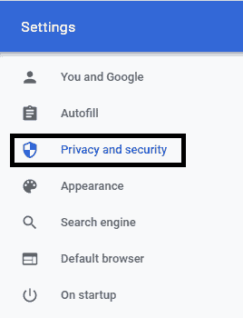
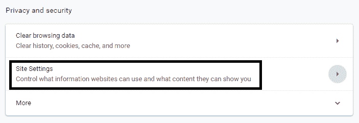
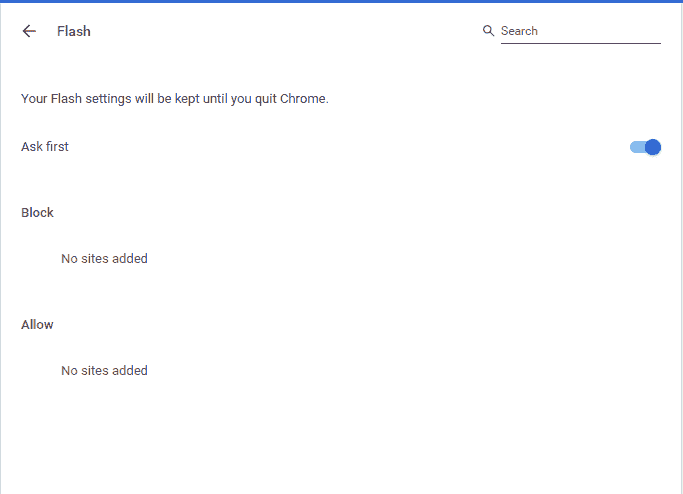

# 如何在 Chrome 上允许 flash？

> 原文：<https://www.javatpoint.com/how-to-allow-flash-on-chrome>

**类似提问**

*   如何解锁 Chrome 上的 flash？
*   如何在 Chrome 中启用 flash 播放器？
*   如何在 Chrome 中永久启用 flash？
*   如何在 Chrome 上启用 adobe flash player？

Flash 是一种用于使应用、游戏或网页在图形上更高级的软件，包括动画和交互式内容。它最初是由 Macromedia 在 1996 年 11 月创建的。后来，自 2005 年以来，Adobe 一直致力于其进步。flash 制作的作品用. FLV 扩展名保存，可以通过互联网查看。

动画或交互式[图形用户界面](https://www.javatpoint.com/gui-full-form)等图形活动内容可用于各种应用，如桌面应用、移动应用和基于互联网的应用。这让它们看起来更有吸引力，也更受用户欢迎。因此，它不仅能改善应用或网站的外观，还能增加其受众。

## Flash Player 工作正常吗？

在学习在网络浏览器上启用 flash 之前，应该知道它是否已经在工作。这很容易评估。通常情况下，如果 flash 插件已安装并在您的[浏览器](https://www.javatpoint.com/browsers)上运行，那么每当您打开基于 flash 的应用或[网站](https://www.javatpoint.com/website)时，您都可以看到其徽标。然而，如果不是这样，你会看到一个破碎的拼图块，表示没有闪存来运行应用。这表明闪存被禁用或其余量被阻止。

### 允许 Chrome 部分或全部闪烁的步骤

有两种方法允许 [Chrome 浏览器](https://www.javatpoint.com/google-chrome)闪烁。对于某些特定网站或所有网站，可以部分启用/禁用它。

**步骤 1-** 在浏览器上打开 chrome，当它完全加载后，点击右上角三点⋮表示的**“定制和控制 Google chrome”**菜单。

**步骤 2-** 从下拉菜单中选择**“设置”**选项。将打开一个名为**设置**的新选项卡。

**步骤 3-** 用户可以从多个选项中进行选择进行设置。要启用闪存，您必须选择**“隐私和安全”**选项。

**第 4 步-** 在**隐私与安全**选项下，点击**“站点设置”**选项。

**第 5 步-** 在这个类别中，你需要为不同的东西设置权限，如位置、摄像头、麦克风、广告、通知、图像、Flash 等。

在多个选项中，点击**“闪烁**”现在要允许闪存，请关闭名为**“阻止网站运行闪存(推荐)”的开关按钮**按钮将从变为**蓝色**按钮名称变为**“先问一下。”**

**镀Chrome闪光部分余量**

**步骤 6-** 现在，访问您希望允许或阻止使用 flash 的任何网站。对应地址栏，点击🔒“锁定”图标或🛈“信息”图标。

**第 7 步-** 现在您将看到**闪光**选项和可供选择的选项。您可以选择**询问(默认)、允许、阻止**。点击**“允许”**将特定网页/网站添加到允许使用 flash 的站点。

您已经成功地在 Chrome 中允许 Adobe flash，现在您可以在 Chrome 上听到和看到视频内容。

* * *