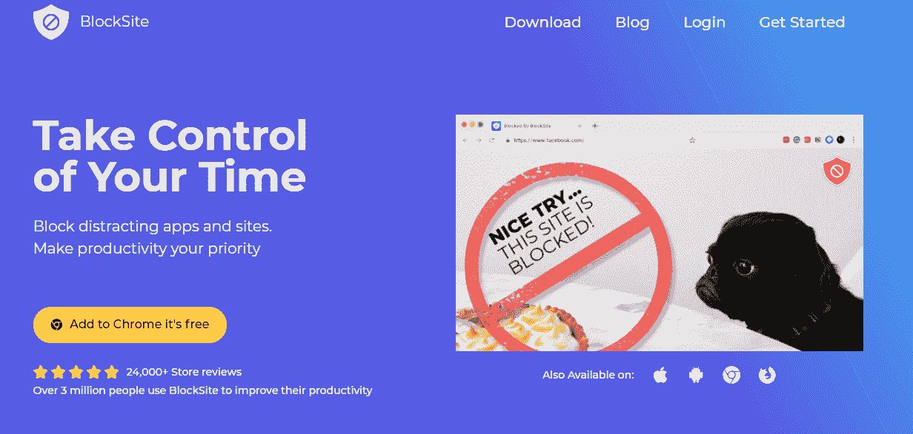
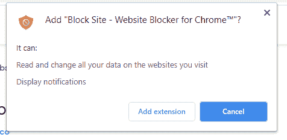
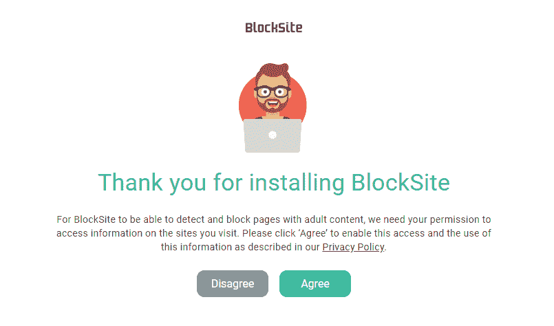
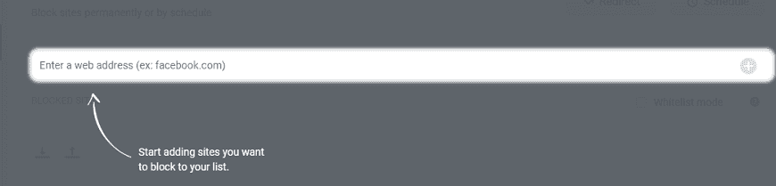
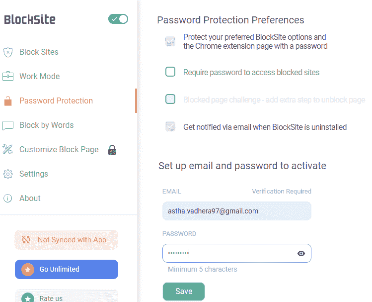
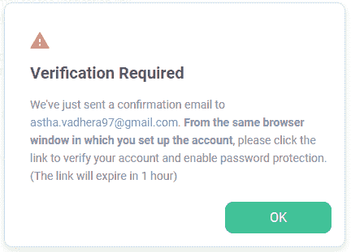
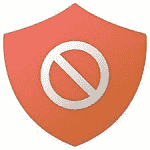

# 如何屏蔽 Chrome 上的网站？

> 原文：<https://www.javatpoint.com/how-to-block-websites-on-chrome>

**类似提问**

*   如何屏蔽 Chrome 上的网站？
*   如何屏蔽谷歌 Chrome 上的网站？
*   如何屏蔽 chrome 手机上的网站？

当用户通过像谷歌浏览器这样的[网络浏览器](https://www.javatpoint.com/browsers)在[互联网](https://www.javatpoint.com/internet)上浏览时，可能会遇到他/她不想再次访问的网站。用户可能会发现这些网站在内容或数据量方面不合适，或者可能会觉得网站的性质是恶意的。这些[网站](https://www.javatpoint.com/website)可能会在工作期间分散注意力，或者对你的系统造成异常行为。

网站上不断出现的烦人广告也可能会让你想要屏蔽它们。阻止访问浏览器上的网站可能有许多个人或专业原因。本文介绍了在[谷歌 Chrome](https://www.javatpoint.com/google-chrome) 上屏蔽一个网站最简单的方法。这将使用区块网站完成。

### 阻止系统上 Chrome 网站的步骤

**步骤 1-** 打开 Chrome，转到[区块站点页面](https://chrome.google.com/webstore/detail/block-site/eiimnmioipafcokbfikbljfdeojpcgbh)可以安装。

阻止网站扩展用于阻止单个页面或整个网站。除此之外，它还授权您控制对阻止列表的访问，以便通过设置密码来保持其完整性。

**第 2 步-** 点击**“添加到铬**”然后，它会将您重定向到一个新地址，您必须在弹出选项中单击**“添加分机”**。这将提示安装块站点。

安装完成后，您将被重定向到以下页面，您需要单击**“同意”**

**步骤 3-** 在这一步中，会加载一个页面，您可以在其中输入要阻止的网站或特定网页。您必须复制粘贴希望添加到阻止列表的网站的网址。填写完输入字段后点击

旁边的按钮。该网站将被成功添加到阻止列表。

**步骤 4-现在，**这一步是为了保护您的阻止列表免受任何不必要的访问或修改。转到**“密码保护”**选项卡。在四个选项中，勾选**“用密码保护你的首选区块网站选项和 Chrome 扩展页面”选项旁边的复选框**

一旦您选中该框，您将被要求输入一个**电子邮件 ID** 和**设置一个密码**。填写完输入字段后，点击**保存**。确保您输入了一个有效的标识，因为需要对其进行验证。

**步骤 5-** 系统将要求您验证输入的电子邮件 ID。**点击，“确定**”现在打开你的电子邮件，点击**“立即核实。”**

**第 6 步** -最后，但最关键的一步是启用隐姓埋名模式。如果不这样做，任何人都可以通过打开[匿名模式](https://www.javatpoint.com/incognito-mode)访问被阻止的网站。因此，限制网站/页面是没有用的。

为此-

*   按下 Chrome 右上角的三个点，从下拉列表中选择“更多工具”，然后单击“扩展”
*   输入上一步中设置的标识和密码，以访问 Chrome 扩展。
*   在“块站点”选项卡上，单击“详细信息”按钮。

*   现在沿着**“允许隐姓埋名”**选项，按下灰色滑动按钮将其变为蓝色。这允许阻止列表在这种模式下也有效。

## 安卓手机屏蔽 Chrome 上的网站

以上过程是针对 [Windows](https://www.javatpoint.com/windows) 桌面描述的。然而，安装和使用阻止网站的过程对安卓手机来说几乎是一样的。唯一的不同点如下:

1.  用户无需通过区块网站页面安装，只需访问**谷歌 Playstore** ，下载区块网站应用，符号如下所示-

    
2.  下载后，您需要通过更改设置来启用阻止站点。
    *   转到“**设置**”
    *   寻找“**可达性”**
    *   找到后，点击“**区块网站**”
        T3】
    *   现在点击灰色**“block site”**按钮将其打开。
    *   然后点击**“确定。”**
3.  使用安卓手机的阻止网站，用户可以阻止整个**应用程序**以及网页和网站。有一个单独的选项卡，您可以在其中添加想要阻止的应用程序。

* * *