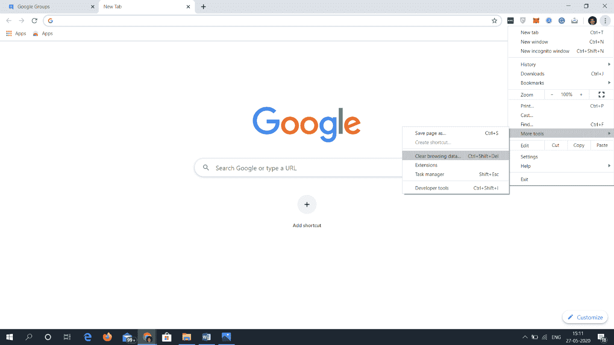
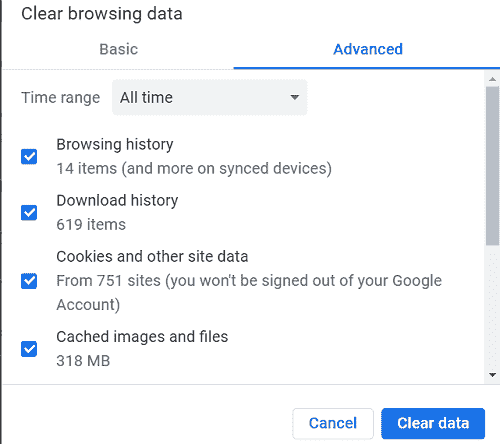
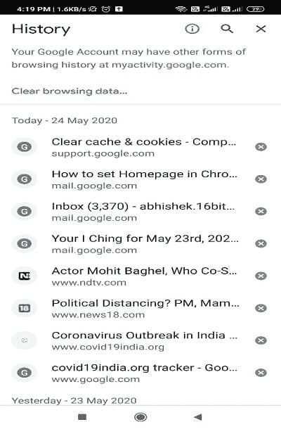
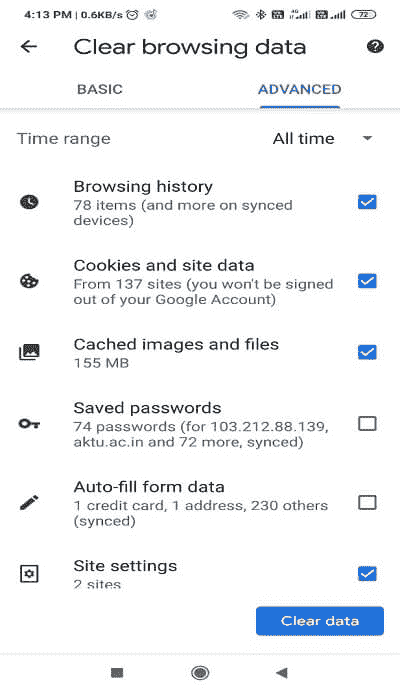
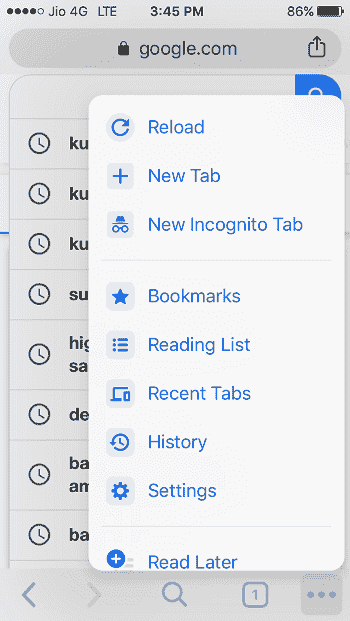
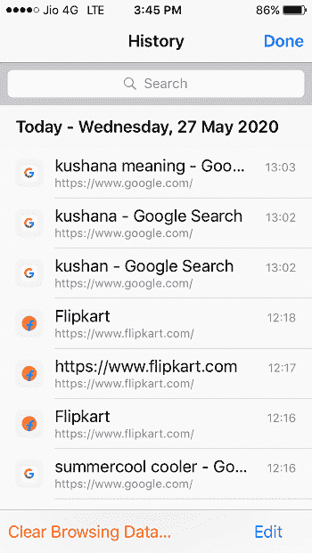
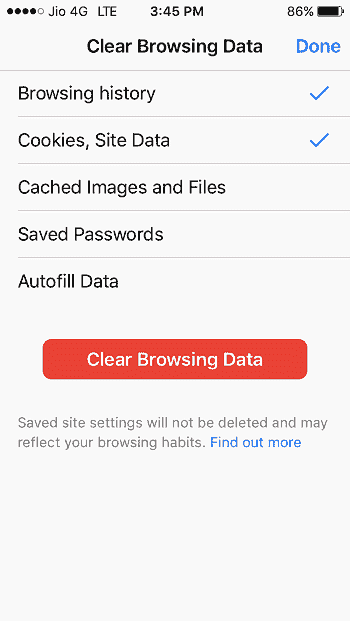

# 如何删除 Chrome 上的 cookies？

> 原文：<https://www.javatpoint.com/how-to-delete-cookies-on-chrome>

**类似提问**

*   如何删除 Chrome 上的 cookies？
*   如何清除 Chrome 上的缓存和 cookies？
*   如何在谷歌 Chrome 上清除 cookies？
*   如何在谷歌 Chrome 上清除历史？
*   如何在谷歌 Chrome 上删除历史？
*   如何清理浏览器缓存 chrome？
*   如何清除 Chrome 中的缓存？
*   如何清洗 Chrome？
*   如何在 Chrome 上清理搜索历史？
*   如何清除 mac chrome 上的 cookies？
*   如何清洁镀铬轮圈？
*   如何清除 iPhone 上的 cookies？

当我们浏览互联网时，各种信息可以以 cookies 的形式保存。Cookies 通常很有用，因为它们记录了登录凭证并收集了我们的个人信息，以便[网站](https://www.javatpoint.com/website)可以记住我们的信息和偏好。它使网上冲浪和交易变得快速而简单。

然而，cookies 会造成严重的损害，因为它们可以保存几个私人细节。详细信息可能包括我们的位置、登录凭证、地址等。Cookies 记录个人数据，以便通过在浏览器上提供自动填充选项来方便交易。所以如果你想通过[互联网](https://www.javatpoint.com/internet)保护你的隐私，你可能要删除这些 cookies。

#### 注意-如果您删除这些 cookies，您将丢失保存的密码和数据。但是，您可以在几分钟内删除 Chrome 上的 cookie，这篇文章将帮助您清除 Chrome 上的 cookie。

## 如何从你的窗口和 Mac 清除 Chrome 上的 cookies 和缓存

### 从窗口清除 Chrome 上的 Cookies 和缓存:

**第一步:**打开系统上的 Chrome 浏览器。

**第二步:**点击右上角可见的三个⋮点，显示菜单栏。

**第三步:**你会发现一个由几个选项组成的下拉菜单，点击“**更多工具”**选项。

**第四步:**点击“**清除浏览数据”，**你会看到各种可以清除数据的选项，你也可以选择一个时间范围。清除一切选择**所有时间**。

**第 5 步:**选中所需的框，删除“Cookies 和其他站点数据”下的“ **Cookies 和其他站点数据”以及“缓存的图像和文件”**。您也可以删除特定站点的 cookies。

**第六步:**点击**清除数据**，开始清除 Chrome 中存储的 cookies 的过程。完成该过程后，您可以关闭选项卡并继续全新浏览。

### 清除安卓设备上 Chrome 中的缓存和 cookies:

**步骤 1:** 打开设备上的 Chrome 应用。

**第二步:**点击应用屏幕右上角可见的三个⋮点，显示一个菜单栏。

**第三步:**点击**【历史】**选项。

**第 4 步:**点击“**清除浏览数据……”**继续。

**步骤 5:** 点击“**清除浏览数据”**然后选择“**cookie 和站点数据”**选项旁边的复选框。

**第六步:**点击“**清除数据”**完成流程。删除后，需要重新登录才能继续新鲜浏览。

### 清除 iOS 设备上 Chrome 中的缓存和 cookies:

**第一步:**打开 iPhone 上的[谷歌 Chrome](https://www.javatpoint.com/google-chrome) 应用。

**第二步:**点击三个水平点，在应用屏幕的最右上角可见，显示一个菜单栏。

**第三步:**点击**【历史】**然后**【清除浏览数据……】**

**步骤 4:** 选择所需选项**(“cookie、站点数据”和“缓存的图像和文件”)**清除保存的 cookie。

**第五步:**现在点击**清除浏览数据**确认您的选择以进行最终删除。

恭喜您，您已经成功删除了保存在您的 Chrome 中的 cookies。现在你可以重新开始浏览了。

* * *