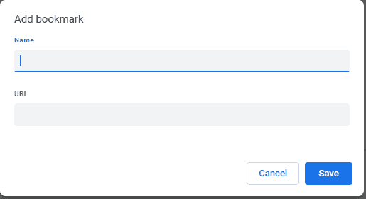
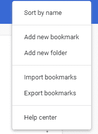
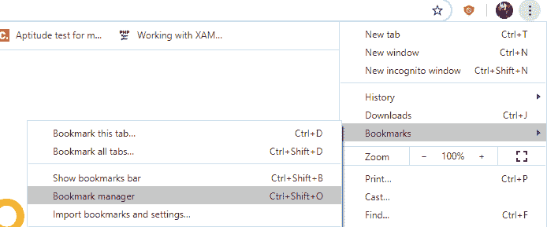

# 如何在 Chrome 中保存书签？

> 原文：<https://www.javatpoint.com/how-to-save-bookmarks-in-chrome>

**类似提问**

*   如何从 Chrome 导入书签？
*   chrome 在哪里存储书签？
*   如何备份 Chrome 书签？

“书签”这个词实际上是指由皮革、纸板、纸张等任何材料制成的纸条或卡片，用来标记一本书的重要一页。它被保存在将来可能需要快速访问的页面之间，例如，小说的最后一页。Chrome 网络浏览器采用了这一概念，以便标记重要的网站/网页供将来参考和使用。[谷歌 Chrome](https://www.javatpoint.com/google-chrome) 提供书签保存、导入、导出功能。在本文中，我们将学习如何在 Chrome 中保存书签。

### 在谷歌浏览器中保存书签的步骤

**方法 1-** 在你的系统上打开 Chrome，访问任何你想要添加书签的[网站](https://www.javatpoint.com/website)。网站/网页加载完成后，点击**“开始”**按钮 ★ 将其保存为书签。网页或网站会添加到书签中。

**方法 2-** 转到**“自定义和控制 Google chrome”**菜单，该菜单位于由 **⋮** 表示的最右上角。然后从下拉列表中选择**“书签”**，并

点击**“书签管理器”**新标签页打开。点击由三个点表示的**“组织”**菜单。从菜单中选择**“添加新书签”**选项。出现以下对话框。填写输入字段，点击**“保存**”

用户可以通过两种方式保存书签，一种是导出并保存，另一种是导入并保存。当您将旧系统更换为新系统或需要重置 Chrome 时，可以使用导出和导入工具。用户可以导出并保存 Chrome 书签，稍后可以在新电脑上导入这些书签。这将有助于将新的[浏览器](https://www.javatpoint.com/browsers)复制到旧的浏览器。

### 导出并保存书签

**第 1 步-** 启动 Chrome，进入**“定制和控制 Google chrome”**菜单，位于最右上角，由⋮表示

**步骤 2-** 然后从下拉列表中选择**“书签”**，点击**“书签管理器”**

**步骤 3-** 这将打开一个新的标签页，地址为 *chrome://bookmarks/* 。点击由三个点表示的**“组织”**菜单。从菜单中选择**“导出书签”**选项。

填写文件名输入字段，设置存储位置，点击**“保存”**

### 导入并保存书签

**步骤 1-** 打开你系统上的 Chrome，进入**“定制和控制 Google chrome”**菜单，最右边的右上角用⋮表示

**步骤 2-** 然后从下拉列表中选择**“书签”**，点击**“书签管理器”**

**第 3 步-** 这将打开一个带有地址 chrome://书签/的新标签页。点击由三个点表示的**“组织”**菜单。从菜单中选择**“导入书签”**选项。填写文件名输入栏，点击**“打开”**

### Chrome 书签存放在哪里？

Chrome 书签存储在菜单栏的书签选项下。点击书签选项下的**显示书签栏**，可以看到保存的书签，如下图所示。我们也可以在 Chrome 中管理保存的书签。

* * *