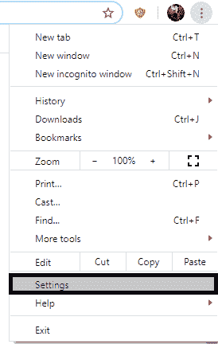
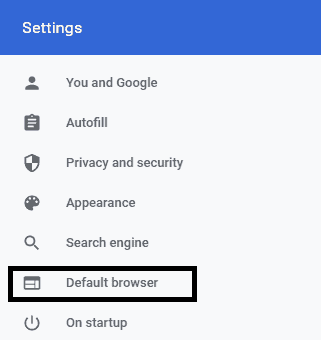
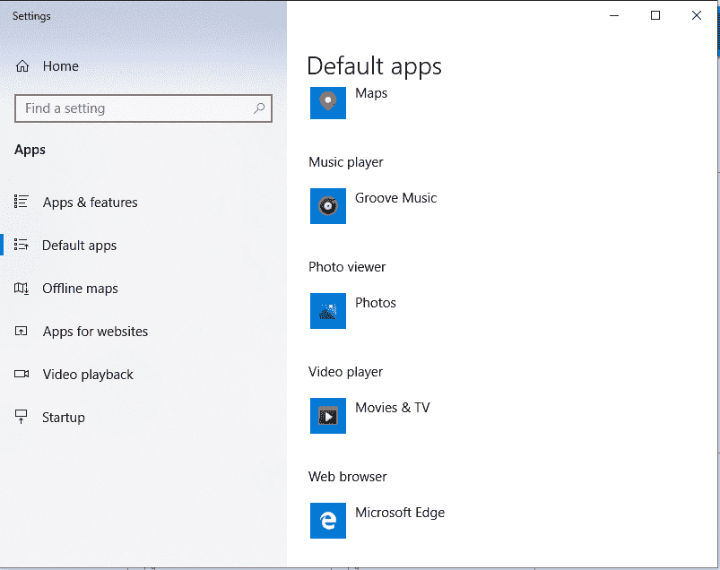
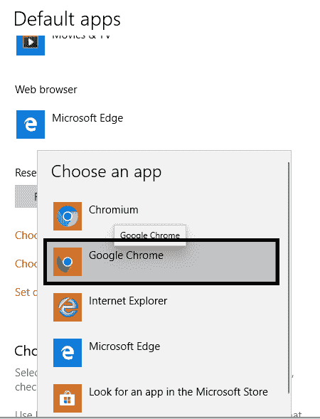
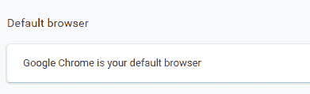

# 如何将 Chrome 设置为默认浏览器？

> 原文：<https://www.javatpoint.com/how-to-set-chrome-as-default-browser>

**类似提问**

*   如何让谷歌 chrome 成为默认浏览器？
*   如何在 iPhone 上做 chrome 默认浏览器？
*   如何让 Chrome 成为我的默认浏览器？

一个**默认浏览器**是一个浏览器，当用户点击一个网页文档时或者当打开一个网页链接时，比如访问一个应用程序的主页，它会自动启动。用户可以从系统上提供的多个浏览器中进行选择，每个浏览器都可以与其他[浏览器](https://www.javatpoint.com/browsers)连续安装。大多数人更喜欢将 Chrome 设置为默认浏览器，因为它具有用户友好的特性。Chrome 是最值得信赖、最快速、最安全的浏览器之一，可以选择作为默认浏览器。将[谷歌浏览器](https://www.javatpoint.com/google-chrome)设置为默认浏览器的步骤将在下面讨论。

### 将 Chrome 设置为计算机默认浏览器的步骤

谷歌 chrome 在你设备的默认浏览器方面是有效的。Chrome 比其他浏览器更安全。这可以通过下面给出的简单步骤快速完成:

**步骤 1-** 在你的系统上启动谷歌 Chrome。加载后，点击**“定制和控制 Google chrome”**菜单，该菜单由屏幕右上角的三个点⋮表示。

**步骤 2-** 出现一个下拉列表，从该下拉菜单中选择**设置**将打开一个新选项卡。

**步骤 3-** 设置选项卡⚙有多个选项可供选择。你可能会看到

诸如“你和谷歌”、“自动填充”、“隐私和安全”、“外观”、“搜索引擎”、“默认浏览器”和“启动时”等选项。在这些选项中，点击**“默认浏览器**”

**第 4 步-** 点击该选项，出现一个名为**“默认浏览器”**的功能，标题下方显示**“将谷歌 Chrome 设为默认浏览器”**。点击该选项对应的**“默认”**按钮。

**第 5 步-** 这将打开一个名为**设置的新窗口，**如下所示。

通过该窗口，用户可以选择地图、音乐播放器、照片查看器、视频播放器和**网络浏览器等多种动作的默认浏览器。**

单击选择为默认的浏览器，查看可设置为网络浏览器默认应用程序的其他选项。从浏览器列表中选择**“谷歌 Chrome”**。

**确认步骤-** 查看 Chrome 是否成功设置为默认浏览器，前往**自定义并控制谷歌 Chrome >设置>默认浏览器。**您会看到与选项对应的如下画面；

### 将 Chrome 设置为安卓默认浏览器的步骤

**第 1 步-** 在手机上，打开**设置。⚙**

**步骤 2-** 找到**“应用和通知”**选项并点击。

**步骤 3-** 在该选项中查找**高级**设置。

**第 4 步-** 点击**高级**，选择**“默认浏览器”**选项。

**步骤 5-** 设置**浏览器应用> Chrome。**

### 如何让 Chrome 成为 iPhone 的默认浏览器？

你不能在 iPhone 上将谷歌 chrome 设为默认浏览器，但你可以在网上冲浪时通过选择 Chrome 应用程序轻松访问 Chrome。苹果从不允许你将默认浏览器从 Safari 更改为 Chrome 或其他浏览器，因此你只能从主屏幕访问 Chrome。

* * *