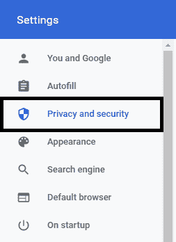
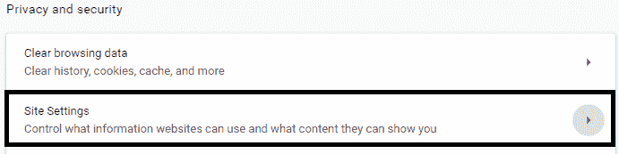
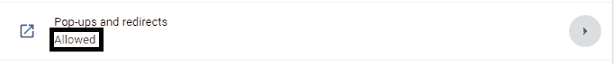
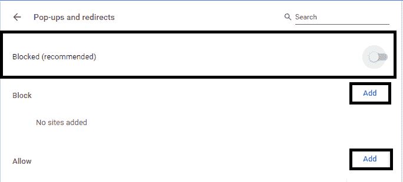

# 如何在 Chrome 中关闭弹出窗口拦截器？

> 原文：<https://www.javatpoint.com/how-to-turn-off-pop-up-blocker-in-chrome>

**类似提问**

*   如何在 Chrome 中禁用弹出窗口拦截器？
*   如何在 Chrome 上允许弹出窗口？
*   如何在 Chrome 上屏蔽弹出窗口？
*   如何在 Chrome 上停止弹出窗口？
*   如何在 Chrome 上启用弹出窗口？
*   如何在 Chrome 中允许弹出窗口？
*   如何摆脱 Chrome 上的弹出广告？
*   如何关闭谷歌 chrome 上的弹出窗口拦截器？
*   如何阻止 Chrome 上的弹出广告？
*   如何解锁 Chrome 上的弹出窗口？

弹出窗口一般是 [GUI](https://www.javatpoint.com/gui-full-form) 的一个小区域，在网上冲浪的时候在屏幕上提示。这些图形用户界面是用 [Javascript](https://www.javatpoint.com/javascript-tutorial) 编写的，甚至可能有像 Adobe 这样的辅助负载。弹出窗口通过网络广告被用于商业化的目的。

然而，没有多少人喜欢娱乐这样的弹出广告，甚至有时觉得很烦人。许多弹出广告可能会严重威胁用户的安全和隐私，或者使您的系统容易受到病毒攻击。这是通过在图形用户界面中创建假按钮、重定向到不安全的网址或欺骗防火墙系统来实现的。某些特定类型的下载文件，如图像、免费盗版音乐或电影(或包含色情内容的网站)可能会引发弹出窗口，因此完全不可信。

出于同样的原因，Chrome 是包括弹出窗口拦截器在内的最可靠和最安全的浏览器之一。Chrome 自发地保护其用户免受安全问题和恶意网站的攻击。它为用户提供了启用/禁用弹出窗口阻止程序或仅阻止/允许来自某些网站的弹出窗口的选项。下面讨论在不同平台上管理 Chrome 中的弹出窗口拦截器需要遵循的步骤。

### 关闭视窗浏览器弹出窗口拦截器的步骤

**步骤 1-** 首先，在你的系统上启动 [Google Chrome](https://www.javatpoint.com/google-chrome) ，进入最右上角由⋮表示的**“定制和控制 Google chrome”**菜单。

**步骤 2-** 从下拉菜单中选择**“设置”**选项。

**第 3 步-** 点击**“隐私与安全”**选项卡。它将提供许多选项来保护您的浏览出现。

**第 4 步-** 在选中的标签下，点击**【站点设置】**按钮。

**步骤 5-** 从给定选项中选择**“弹出窗口并重定向”**。

**步骤 6-** 最后，如果您希望禁用弹出窗口拦截器，那么取消选中**“阻止(推荐)”**框。要在特定网站上启用弹出窗口，请选中**“阻止(推荐)”**，然后单击**“添加”**对应**“允许”**，并键入网站/网页的网址。

在每个平台上，在 Chrome 中启用/禁用弹出窗口拦截器的过程是相同的，因此没有专门提及。出于安全考虑，建议始终启用弹出窗口阻止程序。但是，一些政府官方网站或与工作相关的[网站](https://www.javatpoint.com/website)可能会要求用户禁用拦截器才能成功加载。这些网站上的弹出广告通常是真实的，不会损害您的系统。

* * *