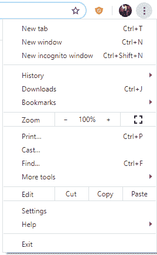
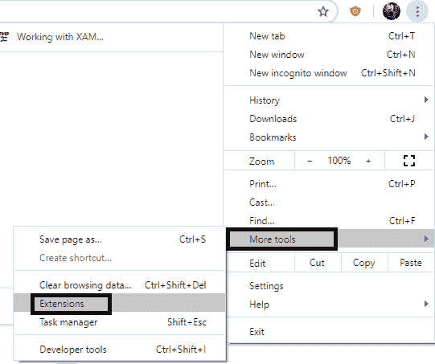
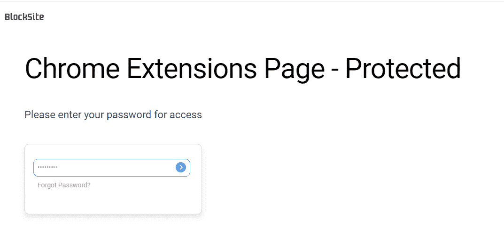
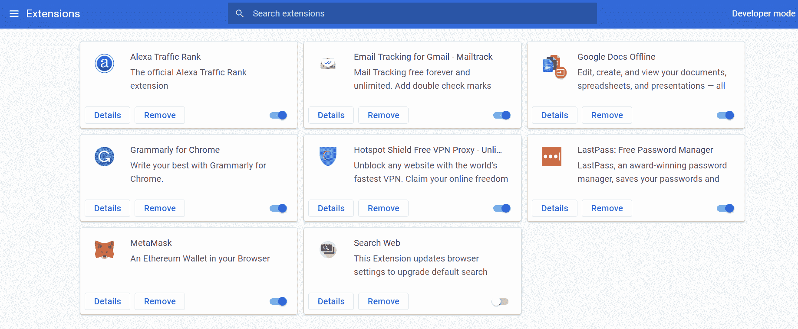
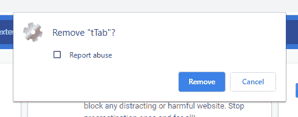

# 如何从 Chrome 中移除扩展？

> 原文：<https://www.javatpoint.com/how-to-remove-extensions-from-chrome>

扩展是增强浏览器功能的小型软件程序或应用程序。这些扩展主要用于根据自己的需要和愿望定制浏览器。简而言之，Chrome 扩展为浏览器提供了很好的功能，这允许更好地使用网络。

[谷歌 Chrome](https://www.javatpoint.com/google-chrome) 是一款网络浏览器，提供了其他浏览器都跳过或缺乏的多项功能。除了浏览速度快、速度好、安全、隐私之外，Chrome 还提供了另外一个这样的功能，用处很大。Chrome 提供了将扩展附加到浏览器的选项。

作为扩展一部分的应用程序或程序一般使用 [HTML](https://www.javatpoint.com/html-tutorial) 、 [CSS](https://www.javatpoint.com/css-tutorial) 、 [Javascript](https://www.javatpoint.com/javascript-tutorial) 等开发。这是一些广泛使用的网络技术。默认情况下，Chrome 会将一些应用作为浏览器的扩展进行链接。这些是谷歌应用程序，如文档、表格、便利贴、幻灯片。

除了传统提供的扩展，用户可以添加/删除任何应用程序或程序作为浏览器的 Chrome 扩展。无论您使用哪种浏览器，理解扩展的作用都是 web 浏览不可或缺的一部分。在下一节中，我们将讨论如何从浏览器中删除扩展。

## 删除谷歌浏览器的扩展

扩展通常很有帮助，但是您应该知道扩展到底做什么以及如何控制它们。如果你的 Chrome 行为不端或者无法关闭一些标签，你可能已经安装了一些恶意的谷歌扩展。我们将逐步向您展示如何删除此类扩展并阻止您的浏览器。

**步骤 1-** 打开系统上的 Chrome。一旦它顺利运行，寻找可用的选项**“定制和控制 Google chrome”**菜单由屏幕右上角的三个点⁝表示。

**步骤 2-** 从下拉列表中，找到**【更多】**并选择。从出现的侧列表中，点击**“分机”**。

**第三步:**如果你的分机是通过 Blocksite 保护的，那么你必须输入密码才能继续；否则，您可以简单地进入下一步。Blocksite 用于通过阻止不需要的网站/网页以及通过密码保护扩展来保护浏览器和系统。

**第四步:**点击后，一个名为**“分机”**的新标签打开。在这里，您将找到目前链接到您的浏览器的所有扩展。屏幕将如下所示。

**第 5 步:**点击页面后，您将看到与每个分机相关联的三个选项:

*   **详情**T2】
*   **移除** 
*   **一个开关按钮** 

如果您希望从浏览器中删除扩展名，可以通过点击**“删除”**按钮来完成。要完全删除扩展，您需要重新启动 Chrome。

#### 注意-如果您只想禁用任何 Chrome 扩展，您可以简单地翻转蓝色开关按钮。它只会将其从浏览器工具栏中移除。

**第六步:**点击删除按钮后，弹出窗口；如果您确定要从浏览器中删除所提到的扩展，请再次点击**“删除”**选项。

扩展名会从“扩展名”选项卡中消失。因此它被成功移除。如果你仍然面临一些问题或者 Chrome 仍然行为不端，那么你可以尝试 **Chrome 清理工具，**一个由谷歌创建的工具。它纠正了目标程序或功能持有弹出广告，默认浏览器或网络引擎的变化，而没有你的确认。

在某些网络浏览器中有一个安全模式选项，允许我们暂时禁用所有已安装的扩展。

* * *