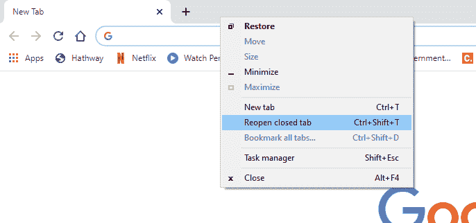
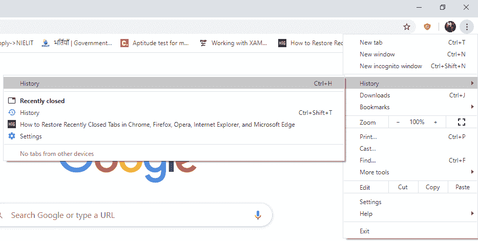

# 如何在 Chrome 中还原标签？

> 原文：<https://www.javatpoint.com/how-to-restore-tabs-in-chrome>

当浏览网页、处理项目、使用社交媒体、在线购物，甚至安装或下载应用程序和软件时，用户可能一次处理多个选项卡。当我们搜索一个主题时，我们会遇到许多网站，并不断在新的选项卡中打开它们，以获得对我们的工作可能最好的信息。

在许多情况下，我们可能会丢失最近正在处理或操作的选项卡。也有可能人们不记得他们使用的每个标签的网址。这可能有很多原因。

1.  由于中央处理器内存导致浏览器崩溃
2.  由于在线流量导致浏览器崩溃和关闭
3.  系统因更新或电池放电而突然关闭
4.  因断电而突然断电
5.  某些病毒攻击导致浏览器损坏。
6.  不小心关闭了某些标签。

还有许多其他原因，但通常情况下，标签会因上述情况而关闭。在某个时间点，用户可能会觉得需要重新访问某个网站或网页以获得某种用途。如果页面没有书签，仍然可以在 [Chrome 浏览器](https://www.javatpoint.com/google-chrome)中恢复。本文将讨论恢复最近关闭的选项卡或历史记录中的选项卡的步骤。

## 恢复最近关闭的选项卡的步骤

**步骤 1-** 首先打开 Chrome 浏览器，让其完全加载

**步骤 2-** 将光标指向屏幕上最上面的区域。当前打开的标签旁边的空白区域被称为**“标签菜单”**

**步骤 3-** 右键单击空白区域中除加号以外的任何位置(打开一个新选项卡)。您将找到一个下拉列表，从中选择您的操作

**第 4 步-** 点击**“重新打开关闭的窗口”**选项。恢复最近关闭的选项卡。

万一你不小心关闭了一个标签，而其他标签还开着。右键单击**“标签菜单”**，选择**“重新打开关闭的标签”**选项。

最近关闭的选项卡也可以通过快捷方式恢复。

按**“Ctrl+Shift+T”**有一个打开最近标签页的快捷方法。每次连续按下时，标签会按照上次关闭的顺序重新打开。

## 在 Chrome 中从历史记录中恢复选项卡的步骤

人们可能想打开一个月前或一周前使用过的页面或网站。即使用户不记得与网站相关联的名称或网址，仍然可以通过访问浏览历史来恢复。请仔细遵循下面给出的步骤。

**步骤 1-** 搜索并点击系统上的 Chrome 应用。完成后，点击**“定制并控制谷歌浏览器”**菜单，用三个点⁝表示

**第 2 步-** 从下面出现的选项下拉列表中，点击**历史**。

**第 3 步-** 在随后打开的边列表中点击**【历史】**。

**第 4 步-** 一个新的选项卡打开，其中包含最近一天到最早一天的浏览历史。您可以在历史记录中找到该选项卡，然后单击订单重新打开它。

* * *