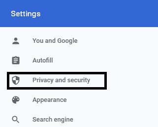
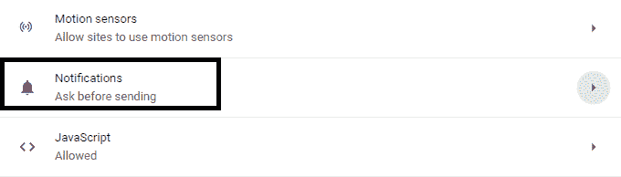
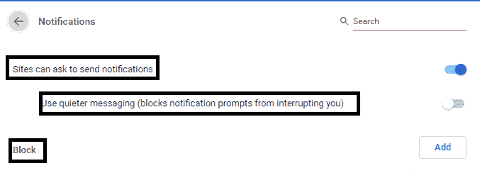
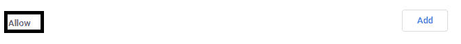

# 如何在 Chrome 中关闭通知？

> 原文：<https://www.javatpoint.com/how-to-turn-off-notifications-in-chrome>

**类似提问:**

*   如何关闭 Chrome 通知？
*   如何在 Chrome 中禁用通知？
*   如何在谷歌 Chrome 中关闭通知弹出窗口？
*   如何停止 Chrome 的通知？
*   如何关闭 Chrome 上的通知？
*   如何屏蔽 Chrome 的通知？

通知是用户从各种网站、应用或扩展中获得的警报或提醒。在 Chrome 中，每个网站都会询问用户是否允许来自该网站的通知。在[隐姓埋名模式](https://www.javatpoint.com/incognito-mode)下，根本不通知用户。

为了获得无拥挤的浏览体验，用户可能希望部分阻止某些站点发送通知，同时允许其他站点发出通知。这在使用 Chrome 时也是可能的。[谷歌 Chrome](https://www.javatpoint.com/google-chrome) 提供了阻止来自某些网站的通知并允许来自其他网站的通知的功能。如果您愿意，他们还可以阻止/允许来自所有站点或应用的通知。

虽然对于某些特定的网站，通知可能是有用的，但有时还是有必要阻止 Chrome 的通知。在本文中，我们将讨论在桌面和手机上的 Chrome 中阻止通知的重要步骤。

### 在台式机/移动设备上阻止 Chrome 通知的步骤

**步骤 1-** 启动系统上已经安装的谷歌 Chrome 应用。一旦它完全加载并且主页打开，搜索右上角由⁝表示的**“定制和控制 Google chrome”**菜单。

**步骤 2-** 点击下拉菜单中的**“设置”**选项。

**步骤 3-** 然后搜索并打开**“隐私与安全”**选项卡。有许多选项可以保护您的浏览器免受这些错误通知的影响。这些包括**清除浏览数据**，通过**网站设置**控制网站使用和显示的信息等。

**第 4 步-** 从可用选项列表中，点击**的【地点设置】**按钮。

**第 5 步-** 选择**【通知】**🔔给定选项中的选项。

**步骤 6-** 现在，有多种方法可以阻止/允许浏览器上的通知。

1.  **阻止/允许所有通知** -为此，打开/关闭**“网站可以请求发送通知”**。这可以通过点击旁边的开关按钮来完成。
2.  **屏蔽某个特定网站** -对应**【屏蔽】**选项，点击**【添加】**。输入您想要阻止的网站的[网址](https://www.javatpoint.com/url-full-form)，点击**“添加”**。
3.  **要允许某个特定网站** -为此，对应**“允许”**选项，点击**“添加”**。输入您希望允许访问的网站的网址，点击**“添加”**。
4.  **允许更快且无时间的通知提示** -这可以通过允许“**网站请求发送通知”**然后单击“**使用更安静的消息传递(阻止通知提示打断您)**来轻松完成。

如果用户忽略来自某个网站的多个通知，它将禁用该网站的通知。如果其他服务器通常不允许来自被访问网站的通知，它也会阻止即将到来的无用通知。

同样，任何向您发送通知的应用或扩展也会被阻止。

单击“删除”选项停止该网站的通知。对于您希望停止接收谷歌浏览器通知的任何网站或服务，您都可以遵循并重复该过程。

* * *