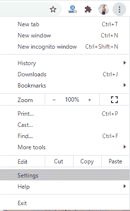
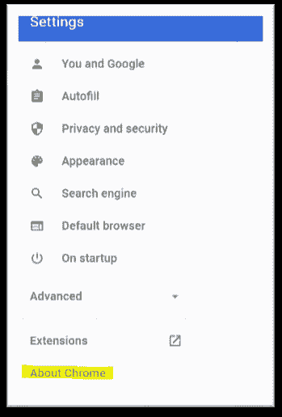
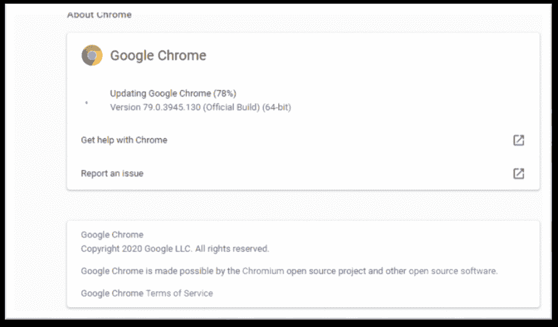
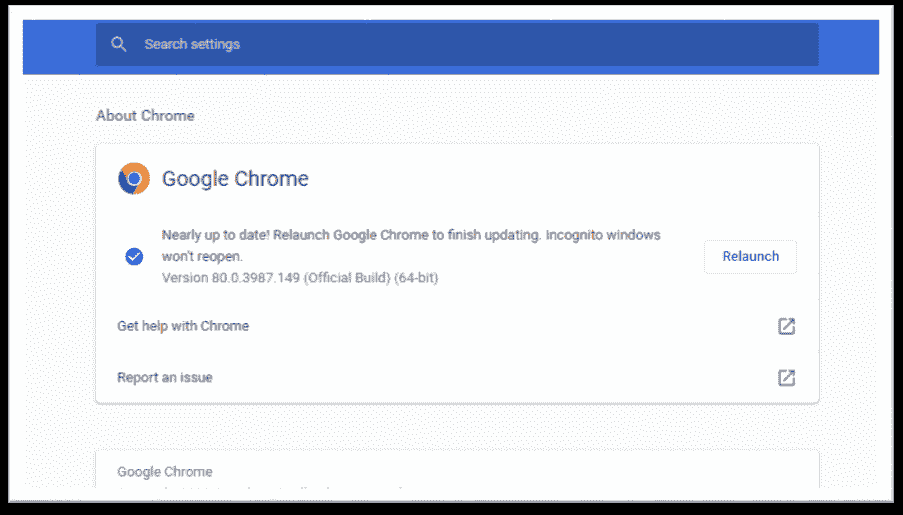
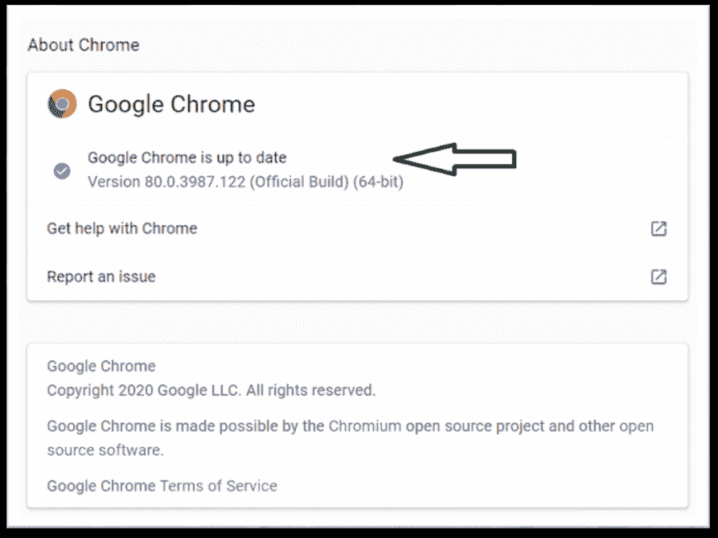

# 如何更新谷歌 chrome？

> 原文：<https://www.javatpoint.com/how-to-update-google-chrome>

**类似提问:**

*   如何更新 Chrome？
*   如何在 mac 上更新 Chrome？
*   如何更新谷歌 chrome 的最新版本？
*   我有什么版本的 Chrome？

[Chrome](https://www.javatpoint.com/google-chrome) 是一款在线搜索引擎，充当跨平台的免费软件网页浏览器。Chrome 可以在所有设备上运行，从你的笔记本电脑到你的 iPhone 或安卓手机。Chrome 第一版于 2008 年发布，仅适用于[微软视窗](https://www.javatpoint.com/windows)；后来，它可用于任何操作系统。

谷歌已经提供了一份公开日历，上面有 Chrome 即将更新的预计日期。为了通过新的安全更新来确保浏览器的安全，谷歌浏览器可能已经自动更新了最新版本。为此，必须有新版本的浏览器。有了这些更新，您有时可能会发现您的浏览器看起来有所不同。通常，当您关闭浏览器并重新打开它时，更新会在后台进行。

### 更新你的浏览器:

本教程将帮助您更新个人电脑和移动设备上的 chrome 浏览器。更新的浏览器对于使用最新功能安全快速地浏览是必要的。每当发布新版本的浏览器时，谷歌浏览器都会自动查找和更新。这是第一个具有自动更新功能的浏览器。

尽管 Chrome 会在后台自动下载最新的更新，但您仍然需要重新启动 Chrome 来安装最新下载的版本。有时，由于用户数量的原因，自动更新需要一天到一整周的时间。谷歌一直在检查新的更新，直到你从设置中禁用它。

### 如何在桌面上更新 Chrome？

**第一步:**打开已经安装在电脑上的谷歌 Chrome 应用。

**第二步:**点击右上角可见的三个垂直点⋮。

**第三步:**点击设置选项。

**第四步:**你会在左下角找到一个**关于 chrome** 的选项。点击那个

**第五步:**如果 Chrome 没有更新，那么你会发现更新谷歌 Chrome 选项。如果没有更新选项，则它已经更新到最新版本。

**第 6 步:**点击**重新启动**标签。

浏览器将保存您以前的选项卡，重新启动窗口，并自动重新打开除匿名窗口以外的所有选项卡。

**你也可以搜索帮助选项，导航帮助>关于谷歌浏览器**查看最新的更新版本，如果有的话。

#### 注意:请记住保存您正在处理的数据，因为 Chrome 会在更新最新版本后重新打开窗口。它会在更新后重新打开所有以前的选项卡，但仍然不会保留您正在处理的数据。

### 如何在 iPhone 和 iPad 上更新 Chrome:

更新后的 Chrome 总是带有最新、快速和安全的功能。尽管 Chrome 应用会在有新更新时通知您，但您仍然可以按照以下步骤进行检查。

**第一步:**打开苹果设备上的 App Store，搜索配置文件选项。

**步骤 2:** 然后打开可见屏幕右上角的配置文件选项。

**步骤 3:** 在“可用更新”选项中搜索 Chrome 更新。

**第四步:**如果谷歌 chrome 已经在那里列出，可以点击更新安装进行更新。有时它可能会要求您的苹果标识密码来下载和安装更新。

### 如何在安卓系统上更新 Chrome:

你可以仔细按照下面提到的步骤在任何[安卓](https://www.javatpoint.com/android-tutorial)设备上更新谷歌 Chrome 应用。

**第一步:**打开设备上的 play store 应用，点击屏幕左上角的菜单按钮。

**第二步:**点击我的应用&游戏，找到更新选项。

**第三步:**在“更新”选项下找到 Chrome，点击 Chrome 旁边可用的更新选项。

你也可以通过点击谷歌 Chrome 应用来更新 Chrome。单击屏幕右上方可见的三个点，然后单击更新选项。

* * *